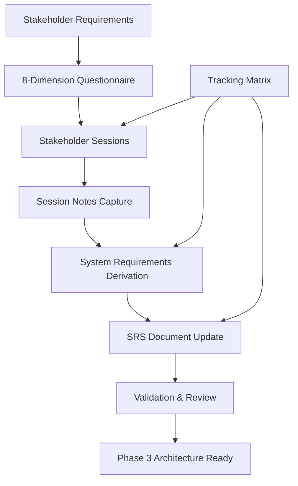

# Phase 2 Requirements Elicitation Deliverables Summary

## AES5-2018 Preferred Sampling Frequencies Implementation

### Executive Summary

This document summarizes the **Phase 2 Requirements Elicitation** deliverables created to systematically transform stakeholder requirements into detailed system requirements using the **8-dimension elicitation framework**. All deliverables follow **ISO/IEC/IEEE 29148:2018** standards compliance.

### Deliverables Created

#### 1. Requirements Elicitation Questionnaire (REQ-ELICIT-001)
- **File**: `requirements-elicitation-questionnaire.md`
- **Purpose**: Comprehensive questionnaire applying 8-dimension framework to all stakeholder requirements
- **Content**: 
  - 8-dimension framework definition (Functional, Boundaries, Errors, Performance, Security, Compliance, Integration, Prioritization)
  - Detailed questions for STR-FUNC-001 (48 kHz primary frequency)
  - Structured questions for STR-FUNC-002 (standard frequencies) and STR-FUNC-003 (multiple frequencies)
  - Progress tracking mechanism
- **Status**: Ready for stakeholder sessions
- **Next Action**: Conduct stakeholder interviews using these questions

#### 2. Requirements Elicitation Tracking Matrix (REQ-ELICIT-002)
- **File**: `requirements-elicitation-tracking-matrix.md`
- **Purpose**: Track systematic elicitation progress across all stakeholder requirements and 8 dimensions
- **Content**:
  - Progress matrix showing completion status for each requirement × dimension
  - Current focus on STR-FUNC-001 with 25% completion status
  - Stakeholder engagement schedule and timeline
  - Risk management and quality gates
- **Status**: Active tracking document
- **Next Action**: Update progress as stakeholder sessions are completed

#### 3. System Requirements Specification Template (SRS-AES5-001)
- **File**: `system-requirements-specification.md`
- **Purpose**: ISO/IEC/IEEE 29148:2018 compliant SRS document template with preliminary system requirements
- **Content**:
  - Complete SRS structure following ISO standards
  - Detailed functional requirements (SYS-FUNC-001/002/003) derived from stakeholder requirements
  - Non-functional requirements (performance, reliability, maintainability, portability)
  - System constraints and compliance requirements
  - Traceability matrix linking system requirements to stakeholder requirements and AES5-2018 clauses
- **Status**: Draft with preliminary requirements, ready for elicitation results
- **Next Action**: Update with detailed requirements from stakeholder elicitation sessions

#### 4. Requirements Elicitation Session Notes Template (REQ-SESSION-001)
- **File**: `requirements-elicitation-session-notes-template.md`
- **Purpose**: Structured template for capturing stakeholder responses during elicitation interviews
- **Content**:
  - Session information capture (participants, objectives, timing)
  - 8-dimension response recording structure
  - System requirement derivation methodology
  - Quality assurance checklist and validation process
- **Status**: Template ready for use
- **Next Action**: Use for all stakeholder elicitation sessions

### Implementation Approach

#### 8-Dimension Elicitation Framework Applied
Each stakeholder requirement is systematically examined across:

1. **Functional Behavior** - Exact operations and behaviors required
2. **Boundaries & Interfaces** - System scope and external interactions
3. **Error Handling** - Failure modes and recovery mechanisms
4. **Performance** - Timing, throughput, resource requirements
5. **Security** - Access control and protection requirements
6. **Compliance** - AES5-2018 and regulatory adherence
7. **Integration** - Dependencies and system composition
8. **Prioritization** - Business criticality and trade-offs

#### Phase 2 Process Flow

### Current Status

#### Completed ✅
- **Requirements Elicitation Framework Setup** - All templates and processes defined
- **Comprehensive Questionnaire** - Questions prepared for all stakeholder requirements
- **SRS Template** - ISO-compliant structure with preliminary system requirements
- **Progress Tracking** - Matrix and process for monitoring elicitation progress

#### In Progress 🔄
- **STR-FUNC-001 Elicitation** - 48 kHz primary frequency (25% complete, questions prepared)
- **Stakeholder Session Scheduling** - Coordinating with audio engineers and product managers

#### Pending ⏳
- **STR-FUNC-002/003 Elicitation** - Standard and multiple frequencies
- **Quality Attributes Elicitation** - Performance, reliability, maintainability, portability  
- **Constraints Elicitation** - Hardware abstraction and standards compliance
- **SRS Finalization** - Complete system requirements specification

### Quality Assurance

#### ISO/IEC/IEEE 29148:2018 Compliance
- ✅ **Requirements Process** - Systematic elicitation following standard practices
- ✅ **Documentation Format** - SRS structure per ISO standards
- ✅ **Traceability** - Links from stakeholder to system requirements maintained
- ✅ **Validation Process** - Stakeholder review and approval mechanisms defined

#### AES5-2018 Compliance  
- ✅ **Standards Alignment** - All requirements mapped to specific AES5-2018 clauses
- ✅ **Technical Accuracy** - Frequency specifications per AES5-2018 requirements
- ✅ **Scope Management** - Strict adherence to AES5-2018 preferred sampling frequencies

### Next Steps (Immediate)

#### Week 1 (2025-11-07 to 2025-11-13)
1. **Conduct STR-FUNC-001 Elicitation Session** (2025-11-07)
   - Use prepared 8-dimension questionnaire
   - Capture responses in session notes template
   - Derive detailed system requirements for 48 kHz support

2. **Update SRS with STR-FUNC-001 Results** (2025-11-08)
   - Incorporate elicited requirements into SRS document
   - Update traceability matrix
   - Review and validate with stakeholders

3. **Begin STR-FUNC-002/003 Elicitation** (2025-11-09)
   - Schedule sessions for standard and multiple frequencies
   - Apply same 8-dimension methodology
   - Focus on multi-frequency interactions and priorities

#### Week 2 (2025-11-14 to 2025-11-20)
4. **Complete Quality Attributes Elicitation** (2025-11-14)
   - Performance requirements (latency, throughput, resources)
   - Reliability requirements (error recovery, fault tolerance)
   - Maintainability and portability requirements

5. **Finalize SRS Document** (2025-11-15)
   - Complete system requirements specification
   - Full traceability matrix validation
   - Stakeholder sign-off preparation

### Success Criteria

#### Phase 2 Complete When:
- ✅ All stakeholder requirements elicited across 8 dimensions
- ✅ Complete SRS document with detailed system requirements  
- ✅ Full traceability from stakeholder requirements to system requirements to AES5-2018 clauses
- ✅ Stakeholder validation and approval of all elicited requirements
- ✅ Quality gates passed for Phase 3 architecture design readiness

#### Key Performance Indicators
- **Elicitation Coverage**: 100% of stakeholder requirements × 8 dimensions
- **SRS Completeness**: All sections per ISO 29148:2018 completed
- **Stakeholder Satisfaction**: >90% approval rating for elicited requirements
- **AES5-2018 Compliance**: 100% of requirements traceable to standard clauses

### Risk Mitigation

#### High Priority Risks Addressed
- **Stakeholder Availability** → Flexible scheduling, recorded sessions, async follow-up
- **Technical Complexity** → Expert consultation, iterative refinement, prototype validation
- **Requirements Scope Creep** → Strict AES5-2018 scope adherence, change control process

### Documentation Quality

All deliverables include:
- **Version Control** - Semantic versioning, change tracking
- **Standards Compliance** - ISO/IEC/IEEE 29148:2018 format adherence
- **Approval Process** - Defined review and sign-off procedures  
- **Traceability** - Complete requirement lineage maintenance

---

**Summary Control:**
- **Created**: 2025-11-06
- **Phase 2 Status**: Framework Complete, Elicitation Ready to Execute
- **Next Milestone**: M2 - Architecture & Design Foundation (2025-11-25)
- **Approval**: Project Manager, Lead Architect, QA Manager