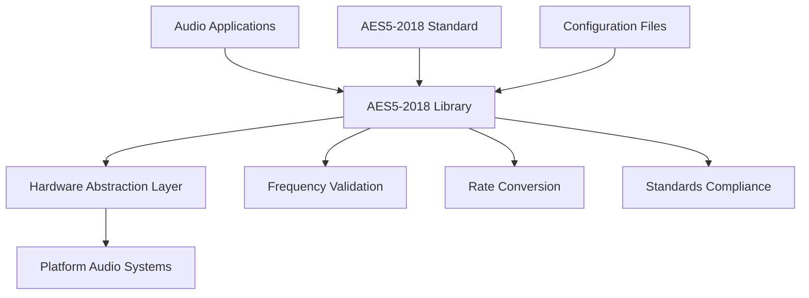

# System Requirements Specification

## AES5-2018 Preferred Sampling Frequencies Library Implementation

### 1. Introduction

#### 1.1 Purpose

This System Requirements Specification (SRS) defines the detailed functional and non-functional requirements for implementing the AES5-2018 preferred sampling frequencies standard as a hardware-agnostic C++17 library. This document transforms stakeholder requirements into precise, verifiable system requirements suitable for architecture and design phases.

#### 1.2 Scope

The system provides:

- **Primary Frequency Support**: 48 kHz sampling frequency management per AES5-2018 Clause 5.1
- **Standard Frequencies Support**: 44.1 kHz, 32 kHz, 96 kHz per AES5-2018 Clause 5.2
- **Multiple Frequencies Support**: 2×, 4×, 8× multiples per AES5-2018 Clause 5.3
- **Hardware Abstraction**: Platform-independent implementation with dependency injection
- **Cross-Platform Compatibility**: Embedded ARM to desktop x86 platforms

#### 1.3 Definitions, Acronyms, and Abbreviations

| Term | Definition |
|------|------------|
| **AES5-2018** | Audio Engineering Society Standard AES5-2018 "Preferred sampling frequencies for applications employing pulse-code modulation" |
| **Primary Frequency** | 48 kHz sampling frequency as recommended by AES5-2018 Clause 5.1 |
| **Standard Frequencies** | Additional frequencies (44.1, 32, 96 kHz) per AES5-2018 Clause 5.2 |
| **Rate Categories** | Frequency multiples (basic, double, quadruple, octuple) per AES5-2018 Clause 5.3 |
| **Hardware Abstraction** | Interface layer enabling platform-independent operation |
| **PCM** | Pulse Code Modulation - digital audio encoding method |

#### 1.4 References

- **ISO/IEC/IEEE 29148:2018** - Systems and software engineering — Life cycle processes — Requirements engineering
- **AES5-2018** - Preferred sampling frequencies for applications employing pulse-code modulation
- **Stakeholder Requirements Specification** - `stakeholder-requirements-spec.md`
- **Requirements Elicitation Questionnaire** - `requirements-elicitation-questionnaire.md`

#### 1.5 Overview

This SRS follows ISO/IEC/IEEE 29148:2018 structure and contains:

- Section 2: Overall Description (system context and constraints)
- Section 3: Functional Requirements (detailed system behaviors)
- Section 4: Non-Functional Requirements (quality attributes)
- Section 5: System Constraints (technical and business limitations)
- Section 6: Verification and Validation (testing requirements)

### 2. Overall Description

#### 2.1 System Context

#### 2.2 System Functions

The system provides three primary function groups:

1. **Frequency Management** - Validation, detection, and selection of AES5-2018 compliant frequencies
2. **Rate Conversion** - Sample rate conversion between supported frequencies
3. **Standards Compliance** - Verification and reporting of AES5-2018 adherence

#### 2.3 User Characteristics

- **Audio Software Developers**: Integrate AES5-2018 support into applications
- **System Integrators**: Deploy library across different hardware platforms
- **Quality Assurance Engineers**: Verify AES5-2018 compliance and interoperability
- **Platform Engineers**: Adapt library to specific hardware implementations

#### 2.4 Operating Environment

- **Target Platforms**: Embedded ARM (Cortex-A/R), x86/x64 desktop, server environments
- **Operating Systems**: Linux, Windows, macOS, real-time operating systems (RTOS)
- **Compiler Support**: C++17 compliant compilers (GCC 7+, Clang 6+, MSVC 2017+)
- **Memory Constraints**: Configurable for 1MB-1GB available memory ranges
- **Real-time Requirements**: Support for hard real-time constraints (<1ms latency)

### 3. Functional Requirements

#### 3.1 Primary Frequency Support (STR-FUNC-001)

**Requirement ID**: SYS-FUNC-001  
**Derived From**: STR-FUNC-001  
**Priority**: Critical (P0)

##### 3.1.1 48 kHz Frequency Validation

**SYS-FUNC-001.1**: The system SHALL validate that input sampling frequencies exactly match 48000 Hz ±0.1% tolerance.

**Input**: Sampling frequency value (uint32_t)  
**Output**: Validation result (aes5_validation_result_t)  
**Behavior**: 
- Accept frequencies in range 47952-48048 Hz
- Return AES5_VALIDATION_SUCCESS for valid frequencies
- Return AES5_VALIDATION_ERROR_OUT_OF_TOLERANCE for invalid frequencies
- Log validation attempts with timestamps

**SYS-FUNC-001.2**: The system SHALL provide 48 kHz frequency detection from audio stream metadata.

**Input**: Audio stream header (PCM format)  
**Output**: Detected frequency and confidence level  
**Behavior**:
- Parse WAV, AIFF, BWF file headers
- Extract sampling frequency from format chunks
- Validate against AES5-2018 requirements
- Return confidence score (0-100%)

##### 3.1.2 48 kHz Processing Operations

**SYS-FUNC-001.3**: The system SHALL process 48 kHz audio with configurable precision timing.

**Input**: Audio samples (PCM data), precision mode (enum)  
**Output**: Processed audio samples  
**Behavior**:
- Support ±1 ppm precision mode (high-end applications)
- Support ±10 ppm precision mode (professional applications)  
- Support ±50 ppm precision mode (consumer applications)
- Maintain sample accuracy across processing chain

**SYS-FUNC-001.4**: The system SHALL support multiple 48 kHz audio formats.

**Supported Formats**:
- 16-bit signed integer PCM
- 24-bit signed integer PCM (packed/padded)
- 32-bit signed integer PCM
- 32-bit IEEE 754 floating-point
- 64-bit IEEE 754 floating-point

**SYS-FUNC-001.5**: The system SHALL handle 48 kHz processing errors gracefully.

**Error Conditions**:
- Invalid sample format → Return AES5_ERROR_INVALID_FORMAT
- Buffer overflow → Return AES5_ERROR_BUFFER_OVERFLOW  
- Clock drift detection → Return AES5_ERROR_CLOCK_DRIFT
- Processing timeout → Return AES5_ERROR_TIMEOUT

#### 3.2 Standard Frequencies Support (STR-FUNC-002)

**Requirement ID**: SYS-FUNC-002  
**Derived From**: STR-FUNC-002  
**Priority**: High (P1)

##### 3.2.1 Additional Standard Frequencies

**SYS-FUNC-002.1**: The system SHALL support 44.1 kHz sampling frequency per AES5-2018 Clause 5.2.

**Specification**: 44100 Hz ±0.1% tolerance (43956-44244 Hz)  
**Use Case**: Consumer audio compatibility  
**Priority**: High (widespread industry usage)

**SYS-FUNC-002.2**: The system SHALL support 96 kHz sampling frequency per AES5-2018 Clause 5.2.

**Specification**: 96000 Hz ±0.1% tolerance (95904-96096 Hz)  
**Use Case**: High-resolution audio applications  
**Priority**: Medium (professional applications)

**SYS-FUNC-002.3**: The system SHALL support 32 kHz sampling frequency per AES5-2018 Clause 5.4.

**Specification**: 32000 Hz ±0.1% tolerance (31968-32032 Hz)  
**Use Case**: Legacy broadcast compatibility  
**Priority**: Low (legacy support only)

##### 3.2.2 Multi-Frequency Operations

**SYS-FUNC-002.4**: The system SHALL provide frequency priority ordering.

**Priority Order**:
1. 48 kHz (primary recommendation)
2. 44.1 kHz (consumer compatibility)
3. 96 kHz (high-resolution applications)
4. 32 kHz (legacy support)

**SYS-FUNC-002.5**: The system SHALL support runtime frequency switching.

**Requirements**:
- Frequency changes without system restart
- Configurable switching mode (immediate/graceful)
- Notification callbacks for frequency changes
- Rollback capability for failed switches

#### 3.3 Multiple Frequencies Support (STR-FUNC-003)

**Requirement ID**: SYS-FUNC-003  
**Derived From**: STR-FUNC-003  
**Priority**: Medium (P2)

##### 3.3.1 Rate Category Support

**SYS-FUNC-003.1**: The system SHALL support double-rate frequencies (2× multiples).

**Frequencies**: 96 kHz (2×48), 88.2 kHz (2×44.1), 64 kHz (2×32)  
**Tolerance**: ±0.1% for each frequency  
**Performance**: Linear scaling of processing requirements

**SYS-FUNC-003.2**: The system SHALL support quadruple-rate frequencies (4× multiples).

**Frequencies**: 192 kHz (4×48), 176.4 kHz (4×44.1), 128 kHz (4×32)  
**Tolerance**: ±0.1% for each frequency  
**Performance**: May require specialized processing paths

**SYS-FUNC-003.3**: The system SHALL support octuple-rate frequencies (8× multiples).

**Frequencies**: 384 kHz (8×48), 352.8 kHz (8×44.1), 256 kHz (8×32)  
**Tolerance**: ±0.1% for each frequency  
**Performance**: Resource-intensive, may require hardware acceleration

##### 3.3.2 Rate Category Management

**SYS-FUNC-003.4**: The system SHALL automatically detect rate categories.

**Input**: Sampling frequency  
**Output**: Rate category enumeration  
**Categories**: BASIC, DOUBLE, QUADRUPLE, OCTUPLE, HALF, QUARTER  
**Algorithm**: Mathematical relationship validation to base frequencies

### 4. Non-Functional Requirements

#### 4.1 Performance Requirements (STR-QUAL-001)

**Requirement ID**: SYS-PERF-001  
**Derived From**: STR-QUAL-001  
**Priority**: High (P1)

##### 4.1.1 Latency Requirements

**SYS-PERF-001.1**: The system SHALL achieve ultra-low latency for real-time applications.

**Requirements**:
- 48 kHz processing: <1ms latency (48 samples maximum delay)
- Frequency validation: <100μs response time
- Rate conversion: <5ms latency for simple ratios
- Error handling: <10μs for error detection and reporting

##### 4.1.2 Throughput Requirements

**SYS-PERF-001.2**: The system SHALL support configurable channel counts.

**Channel Support**:
- Embedded systems: 2-8 channels minimum
- Desktop systems: 2-64 channels minimum  
- Server systems: 64-256 channels minimum
- Specialized systems: 256+ channels (platform dependent)

##### 4.1.3 Resource Utilization

**SYS-PERF-001.3**: The system SHALL operate within platform-specific resource constraints.

**Memory Requirements**:
- Embedded (minimal): <1MB heap, <128KB stack
- Desktop (standard): <10MB heap, <1MB stack
- Server (extended): <100MB heap, <10MB stack

**CPU Utilization**:
- Normal operation: <5% CPU for stereo 48 kHz
- Peak operation: <20% CPU during frequency switching
- Error conditions: <1% CPU for error handling

#### 4.2 Reliability Requirements (STR-QUAL-002)

**Requirement ID**: SYS-REL-001  
**Derived From**: STR-QUAL-002  
**Priority**: High (P1)

##### 4.2.1 Error Recovery

**SYS-REL-001.1**: The system SHALL recover gracefully from processing errors.

**Recovery Mechanisms**:
- Automatic retry for transient failures (max 3 attempts)
- Fallback to lower quality mode for resource constraints
- Safe shutdown for critical failures
- State preservation during error conditions

##### 4.2.2 Fault Tolerance

**SYS-REL-001.2**: The system SHALL operate continuously under normal conditions.

**Reliability Targets**:
- Mean Time Between Failures (MTBF): >1000 hours continuous operation
- Mean Time To Recovery (MTTR): <1 second for software errors
- Availability: 99.9% uptime during operational periods

#### 4.3 Maintainability Requirements (STR-QUAL-003)

**Requirement ID**: SYS-MAIN-001  
**Derived From**: STR-QUAL-003  
**Priority**: Medium (P2)

##### 4.3.1 Code Quality

**SYS-MAIN-001.1**: The system SHALL maintain high code quality standards.

**Quality Metrics**:
- Code coverage: >95% line coverage, >90% branch coverage
- Static analysis: Zero critical defects, <10 major defects
- Documentation coverage: >90% of public APIs documented
- Cyclomatic complexity: <15 per function average

##### 4.3.2 Configuration Management

**SYS-MAIN-001.2**: The system SHALL support runtime configuration.

**Configuration Options**:
- Frequency tolerance settings (strict/permissive modes)
- Performance vs. quality trade-offs
- Platform-specific optimizations
- Debug and logging levels

#### 4.4 Portability Requirements (STR-QUAL-004)

**Requirement ID**: SYS-PORT-001  
**Derived From**: STR-QUAL-004  
**Priority**: High (P1)

##### 4.4.1 Cross-Platform Compatibility

**SYS-PORT-001.1**: The system SHALL compile and execute on multiple platforms.

**Target Platforms**:
- Linux (x86/x64/ARM): GCC 7+, Clang 6+
- Windows (x86/x64): MSVC 2017+, MinGW-w64
- macOS (x64/ARM64): Clang 10+, Xcode 11+
- Embedded RTOS: ARM GCC, IAR, Keil compiler support

##### 4.4.2 Hardware Abstraction

**SYS-PORT-001.2**: The system SHALL abstract hardware-specific functionality.

**Abstraction Interfaces**:
- Audio sample I/O interface
- High-precision timing interface
- Platform clock synchronization interface
- Memory management interface

### 5. System Constraints

#### 5.1 Hardware Abstraction Constraints (STR-CONST-001)

**Requirement ID**: SYS-CONST-001  
**Derived From**: STR-CONST-001  
**Priority**: Critical (P0)

##### 5.1.1 Hardware Independence

**SYS-CONST-001.1**: The system SHALL NOT depend on specific hardware implementations.

**Prohibited Dependencies**:
- Direct hardware register access
- Vendor-specific audio driver APIs  
- Platform-specific timing mechanisms
- Hard-coded hardware parameters

**Required Abstractions**:
- Dependency injection for hardware interfaces
- Runtime capability detection
- Configurable hardware parameters
- Mock interfaces for testing

#### 5.2 Standards Compliance Constraints (STR-CONST-002)

**Requirement ID**: SYS-CONST-002  
**Derived From**: STR-CONST-002  
**Priority**: Critical (P0)

##### 5.2.1 AES5-2018 Compliance

**SYS-CONST-002.1**: The system SHALL strictly adhere to AES5-2018 specification requirements.

**Compliance Requirements**:
- All supported frequencies must be AES5-2018 compliant
- Frequency tolerances per AES5-2018 recommendations
- Rate category calculations per AES5-2018 Clause 5.3
- No proprietary extensions that violate AES5-2018

**SYS-CONST-002.2**: The system SHALL provide compliance verification capabilities.

**Verification Features**:
- Self-test functions for AES5-2018 compliance
- Compliance reporting and documentation
- Test vector validation against AES5-2018 examples
- Interoperability test support

### 6. Verification and Validation Requirements

#### 6.1 Testing Requirements

**SYS-VV-001**: The system SHALL support comprehensive automated testing.

**Test Categories**:
- Unit tests for each functional requirement (>95% coverage)
- Integration tests for cross-component functionality
- Performance tests for all performance requirements
- Compliance tests for AES5-2018 adherence

#### 6.2 Validation Requirements

**SYS-VV-002**: The system SHALL validate against real-world audio applications.

**Validation Scenarios**:
- Professional audio workstation integration
- Embedded audio device deployment  
- Network audio streaming applications
- File-based audio processing tools

---

**Traceability Matrix**

| System Requirement | Stakeholder Requirement | AES5-2018 Clause | Verification Method |
|-------------------|------------------------|------------------|-------------------|
| SYS-FUNC-001 | STR-FUNC-001 | Clause 5.1 | Automated testing, compliance verification |
| SYS-FUNC-002 | STR-FUNC-002 | Clause 5.2 | Automated testing, format compatibility testing |
| SYS-FUNC-003 | STR-FUNC-003 | Clause 5.3 | Mathematical validation, performance testing |
| SYS-PERF-001 | STR-QUAL-001 | All applicable | Performance benchmarking, resource monitoring |
| SYS-REL-001 | STR-QUAL-002 | All applicable | Reliability testing, fault injection |
| SYS-MAIN-001 | STR-QUAL-003 | All applicable | Code quality metrics, maintainability assessment |
| SYS-PORT-001 | STR-QUAL-004 | All applicable | Cross-platform testing, hardware abstraction validation |
| SYS-CONST-001 | STR-CONST-001 | All applicable | Architecture review, dependency analysis |
| SYS-CONST-002 | STR-CONST-002 | All clauses | Standards compliance testing, certification |

---

**Document Control:**
- **Version:** 1.0.0 (Draft)
- **Created:** 2025-11-06  
- **Status:** Ready for stakeholder review
- **Next Review:** 2025-11-15 (after requirements elicitation completion)
- **Approval Required:** Project Manager, Lead Architect, QA Manager, Audio Engineering Expert