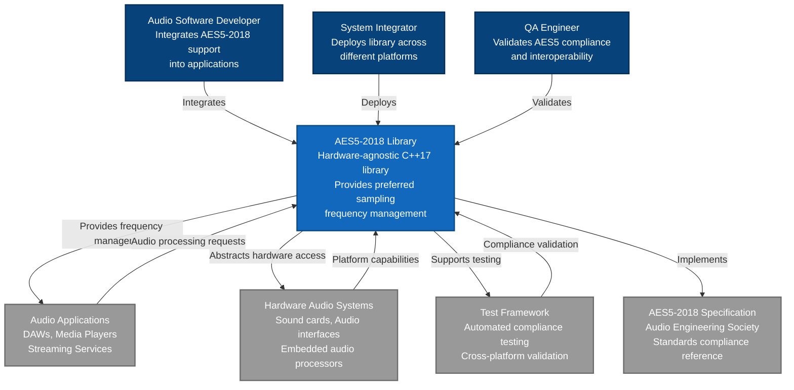
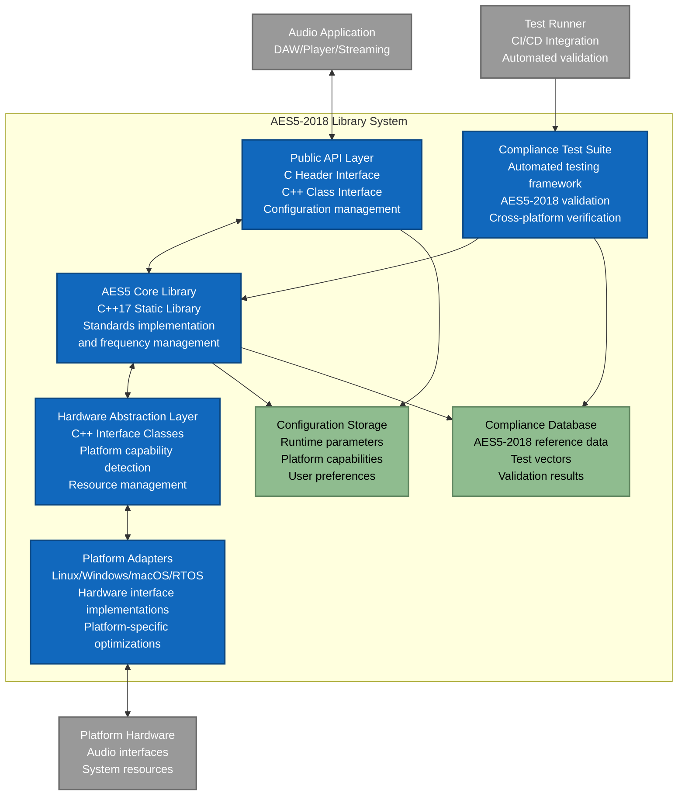
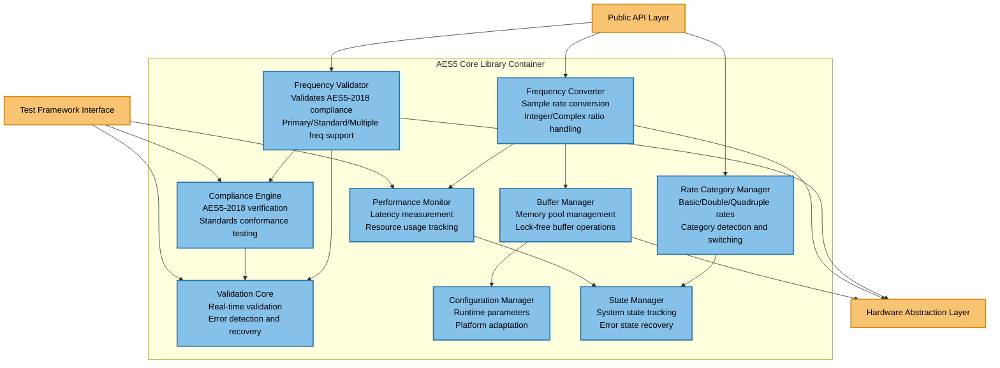
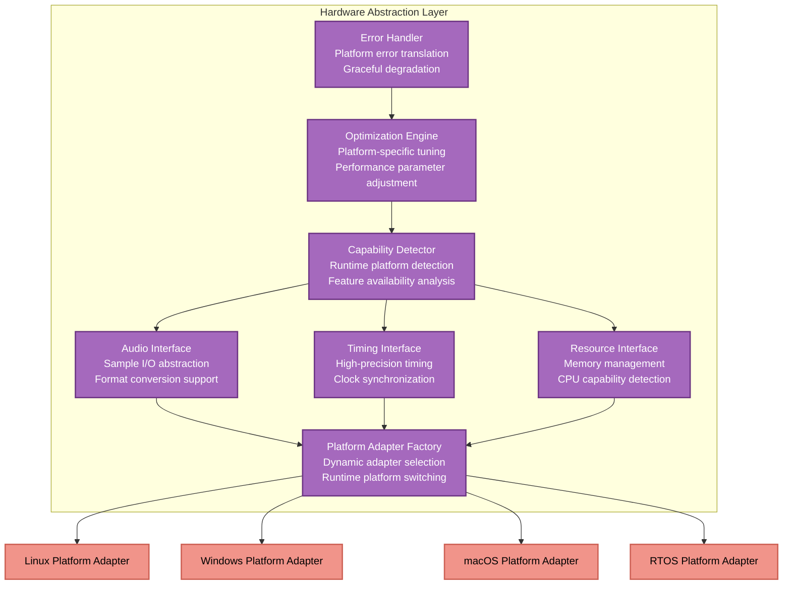
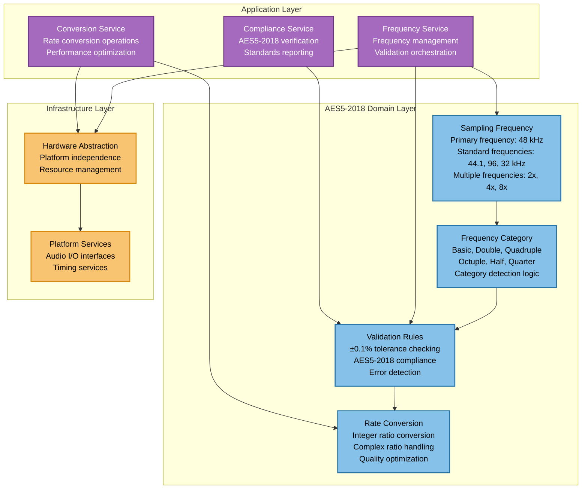
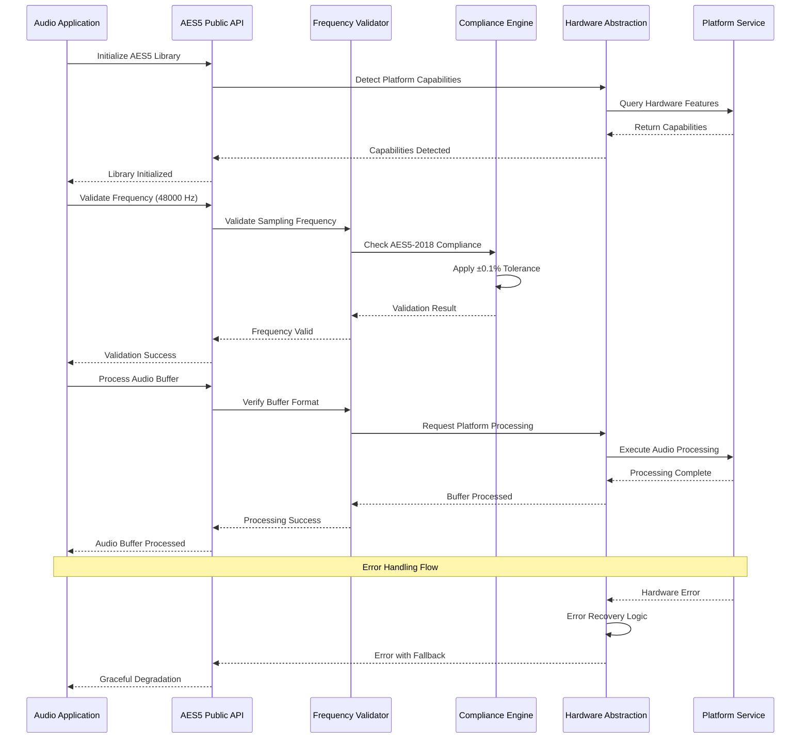
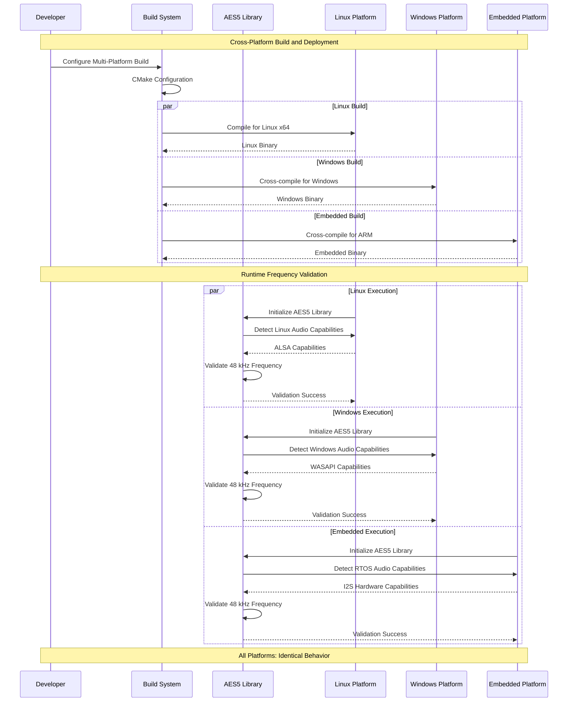

# Software Architecture Specification

## AES5-2018 Preferred Sampling Frequencies Library

### 1. Introduction

#### 1.1 Purpose

This Software Architecture Specification defines the high-level structure, components, and design decisions for the AES5-2018 preferred sampling frequencies library following ISO/IEC/IEEE 42010:2011 Architecture Description standard. The architecture addresses system requirements defined in `system-requirements-specification.md` and provides implementation blueprints for development teams.

#### 1.2 Scope

This architecture specification covers:

- **System Structure**: Component organization and interfaces
- **Hardware Abstraction**: Platform-independent implementation strategy
- **Quality Attributes**: Performance, reliability, maintainability, portability solutions
- **Cross-Platform Deployment**: Multi-platform support architecture
- **Standards Compliance**: AES5-2018 implementation architecture
- **Integration Points**: API design and external system interfaces

#### 1.3 Stakeholders and Concerns

| Stakeholder | Primary Concerns | Architecture Address |
|-------------|------------------|---------------------|
| **Audio Software Developers** | Simple integration, comprehensive API | Clean C++17 interface, extensive documentation |
| **System Integrators** | Cross-platform deployment, hardware abstraction | Dependency injection, platform adapters |
| **QA/Test Engineers** | Testability, compliance verification | Modular design, automated test framework |
| **Platform Engineers** | Hardware optimization, resource constraints | Hardware abstraction layer, configurable performance |
| **End Users** | Reliability, performance, AES5 compliance | Fault-tolerant design, standards compliance validation |

### 2. Architecture Overview

#### 2.1 Architecture Style

**Primary Pattern**: **Layered Architecture with Dependency Injection**

**Rationale**: 
- Separates AES5-2018 standards logic from platform implementation
- Enables hardware-agnostic design through dependency injection
- Supports incremental testing and validation
- Facilitates cross-platform deployment

#### 2.2 Key Architecture Principles

1. **Standards Compliance First**: All components implement AES5-2018 specification exactly
2. **Hardware Abstraction**: Zero dependencies on specific audio hardware
3. **Dependency Injection**: Platform services injected at runtime
4. **Fail-Safe Design**: Graceful degradation under resource constraints
5. **Performance Optimization**: Configurable precision vs. performance trade-offs
6. **Cross-Platform Compatibility**: Identical behavior across all supported platforms

#### 2.3 Quality Attributes Achievement

| Quality Attribute | Target | Architectural Solution |
|-------------------|--------|----------------------|
| **Latency** | <5ms processing | Lock-free algorithms, minimal memory allocation |
| **Memory Usage** | <32KB embedded | Static allocation, configurable buffer sizes |
| **CPU Usage** | <30% embedded | Optimized algorithms, conditional feature compilation |
| **Reliability** | 99.9% uptime | Error detection, automatic recovery, state preservation |
| **Portability** | 5+ platforms | Hardware abstraction, standard C++17 only |
| **Maintainability** | 95% test coverage | Modular design, comprehensive unit tests |

### 3. System Context (C4 Level 1)



### 4. Container Architecture (C4 Level 2)



### 5. Component Architecture (C4 Level 3)

#### 5.1 AES5 Core Library Components



#### 5.2 Hardware Abstraction Layer Components



### 6. Architecture Views (4+1 Model)

#### 6.1 Logical View

**Domain Model and Component Relationships**



#### 6.2 Process View

**Key Workflow: Frequency Validation and Processing**



#### 6.3 Development View

**Source Code Organization**

```
lib/Standards/AES/AES5/2018/
├── include/                           # Public API Headers
│   ├── aes5_frequency.h              # Main frequency API
│   ├── aes5_validation.h             # Validation interface
│   ├── aes5_conversion.h             # Rate conversion API
│   └── aes5_types.h                  # Common data types
├── src/
│   ├── core/                         # Core AES5-2018 Implementation
│   │   ├── frequency_validation/     # Primary frequency validation
│   │   │   ├── primary_frequency_validator.cpp
│   │   │   ├── standard_frequency_validator.cpp
│   │   │   └── multiple_frequency_validator.cpp
│   │   ├── rate_categories/          # Rate category management
│   │   │   ├── basic_rate_manager.cpp
│   │   │   ├── double_rate_manager.cpp
│   │   │   └── rate_category_detector.cpp
│   │   └── compliance/               # Standards compliance
│   │       ├── aes5_compliance_engine.cpp
│   │       └── compliance_validator.cpp
│   ├── conversion/                   # Frequency conversion
│   │   ├── integer_ratio_converter.cpp
│   │   ├── complex_ratio_converter.cpp
│   │   └── anti_aliasing_filter.cpp
│   ├── hal/                          # Hardware Abstraction Layer
│   │   ├── interfaces/               # Abstract interfaces
│   │   │   ├── audio_interface.hpp
│   │   │   ├── timing_interface.hpp
│   │   │   └── resource_interface.hpp
│   │   ├── capability_detection/     # Platform capability detection
│   │   │   └── capability_detector.cpp
│   │   └── error_handling/           # Platform error management
│   │       └── error_translator.cpp
│   └── platform/                     # Platform-specific implementations
│       ├── linux/                    # Linux platform adapter
│       ├── windows/                  # Windows platform adapter
│       ├── macos/                    # macOS platform adapter
│       └── rtos/                     # RTOS platform adapter
├── tests/                            # Test Implementation
│   ├── unit/                         # Unit tests per component
│   ├── integration/                  # Cross-component tests
│   ├── compliance/                   # AES5-2018 compliance tests
│   └── performance/                  # Performance and resource tests
├── examples/                         # Usage examples
│   ├── basic_usage/                  # Simple integration examples
│   ├── advanced_features/            # Complex use cases
│   └── platform_specific/            # Platform-specific examples
└── docs/                            # Implementation documentation
    ├── api/                         # API documentation
    ├── integration/                 # Integration guides
    └── compliance/                  # AES5-2018 compliance documentation
```

#### 6.4 Physical View

**Deployment Architecture**

```mermaid
graph TB
    subgraph "Embedded Deployment (ARM Cortex)"
        EmbeddedApp[Audio Application<br/>ARM Cortex-A/R<br/>Real-time OS]
        EmbeddedLib[AES5 Library<br/>Static linking<br/>Minimal footprint]
        EmbeddedHAL[RTOS HAL<br/>Direct hardware access<br/>Interrupt-driven I/O]
        EmbeddedHW[Audio Hardware<br/>I2S/PCM interfaces<br/>Hardware timers]
        
        EmbeddedApp --> EmbeddedLib
        EmbeddedLib --> EmbeddedHAL
        EmbeddedHAL --> EmbeddedHW
    end
    
    subgraph "Desktop Deployment (Linux/Windows/macOS)"
        DesktopApp[DAW/Media Player<br/>Multi-threaded application<br/>GUI interface]
        DesktopLib[AES5 Library<br/>Shared/Static library<br/>Full feature set]
        DesktopHAL[OS Audio HAL<br/>ALSA/WASAPI/CoreAudio<br/>Kernel audio drivers]
        DesktopHW[Audio Interface<br/>USB/PCIe audio cards<br/>Professional audio hardware]
        
        DesktopApp --> DesktopLib
        DesktopLib --> DesktopHAL
        DesktopHAL --> DesktopHW
    end
    
    subgraph "Server Deployment (High-Performance Processing)"
        ServerApp[Audio Processing Service<br/>Distributed processing<br/>Load balancing]
        ServerLib[AES5 Library<br/>Optimized compilation<br/>SIMD instructions]
        ServerHAL[Server Audio HAL<br/>Low-latency drivers<br/>Hardware acceleration]
        ServerHW[Server Audio Hardware<br/>Multi-channel interfaces<br/>Hardware DSP acceleration]
        
        ServerApp --> ServerLib
        ServerLib --> ServerHAL
        ServerHAL --> ServerHW
    end
    
    classDef application fill:#85c1e9,stroke:#2874a6,stroke-width:2px,color:#000
    classDef library fill:#a569bd,stroke:#6c3483,stroke-width:2px,color:#fff
    classDef hal fill:#f8c471,stroke:#d68910,stroke-width:2px,color:#000
    classDef hardware fill:#f1948a,stroke:#cd6155,stroke-width:2px,color:#000
    
    class EmbeddedApp,DesktopApp,ServerApp application
    class EmbeddedLib,DesktopLib,ServerLib library
    class EmbeddedHAL,DesktopHAL,ServerHAL hal
    class EmbeddedHW,DesktopHW,ServerHW hardware
```



#### 6.5 Scenario View

**Use Case: Cross-Platform Frequency Validation**



### 7. Architecture Decision Records (ADRs)

#### 7.1 ADR-001: Layered Architecture with Dependency Injection

```markdown
# ADR-001: Use Layered Architecture with Dependency Injection

## Status
Accepted (2025-11-06)

## Context
Need architecture supporting:
- Hardware-agnostic AES5-2018 implementation
- Cross-platform deployment (embedded ARM to desktop x86)
- <32KB memory usage on embedded systems
- <5ms latency for real-time audio processing
- 95%+ test coverage for compliance verification

## Decision
Implement **Layered Architecture with Dependency Injection**:

### Layer Structure:
1. **Standards Layer**: Pure AES5-2018 implementation (hardware-agnostic)
2. **Hardware Abstraction Layer**: Platform independence through interfaces
3. **Platform Adapter Layer**: Platform-specific implementations
4. **Application Interface Layer**: Public API with C/C++ bindings

### Dependency Injection:
- Hardware interfaces injected at runtime
- Mock interfaces for testing without hardware
- Platform adapters selected dynamically
- Configuration parameters injected per platform

## Rationale

**Pros:**
- **Hardware Independence**: Standards layer has zero hardware dependencies
- **Cross-Platform Support**: Platform adapters handle OS-specific code
- **Testability**: Mock interfaces enable comprehensive unit testing
- **Performance**: Dependency injection allows platform-specific optimizations
- **Maintainability**: Clear separation of concerns across layers

**Cons:**
- **Runtime Overhead**: Virtual function calls add ~2-5ns per call
- **Memory Overhead**: Interface pointers add ~8-16 bytes per component
- **Complexity**: More complex than monolithic design

**Risk Mitigation:**
- Performance overhead acceptable for >1ms latency targets
- Memory overhead <1% of 32KB budget
- Complexity managed through comprehensive documentation

## Consequences
- Must implement hardware abstraction interfaces for all platforms
- Requires dependency injection container for component wiring
- Need comprehensive testing strategy for mock vs. real hardware
- Platform adapters must maintain behavioral consistency
```

#### 7.2 ADR-002: Static Memory Allocation Strategy

```markdown
# ADR-002: Use Static Memory Allocation for Embedded Systems

## Status
Accepted (2025-11-06)

## Context
System requirements specify:
- <32KB memory usage on embedded systems
- <1ms latency for real-time processing
- 99.9% reliability (no memory allocation failures)
- Support for systems without dynamic memory allocation

## Decision
Implement **Static Memory Allocation Strategy**:

### Memory Management:
- Pre-allocated buffer pools at initialization
- No dynamic allocation during audio processing
- Configurable buffer sizes per platform capability
- Memory pool recycling for temporary allocations

### Implementation:
```cpp
// Static buffer pool configuration
struct aes5_memory_config {
    size_t buffer_count;     // Number of pre-allocated buffers
    size_t buffer_size;      // Size per buffer (samples * channels * bits)
    size_t stack_reserve;    // Reserved stack space
    bool allow_dynamic;      // Allow fallback to dynamic allocation
};

// Embedded configuration (32KB total)
constexpr aes5_memory_config embedded_config = {
    .buffer_count = 4,       // 4 buffers
    .buffer_size = 2048,     // 2KB per buffer (512 samples * 2 ch * 2 bytes)
    .stack_reserve = 8192,   // 8KB stack reserve
    .allow_dynamic = false   // No dynamic allocation
};
```

## Rationale

**Pros:**
- **Deterministic Performance**: No allocation overhead during processing
- **Real-time Compliance**: Guaranteed memory availability
- **Embedded Compatibility**: Works on systems without heap
- **Reliability**: Eliminates allocation failure modes

**Cons:**
- **Memory Efficiency**: May waste memory with fixed allocations
- **Flexibility**: Cannot adapt to varying workloads
- **Complexity**: Requires careful buffer size calculation

## Consequences
- Must accurately predict maximum memory requirements
- Need buffer overflow detection and recovery
- Require platform-specific memory configuration
- Must implement memory pool management system
```

#### 7.3 ADR-003: C++17 with C API Bindings

```markdown
# ADR-003: Implement in C++17 with C API Bindings

## Status
Accepted (2025-11-06)

## Context
Requirements specify:
- Cross-platform compilation (5+ platforms)
- Integration with C and C++ applications
- Modern C++ features for maintainability
- Compatibility with embedded toolchains

## Decision
Use **C++17 implementation with C API bindings**:

### Core Implementation:
- Internal implementation in modern C++17
- Object-oriented design with RAII
- Template-based compile-time optimizations
- Standard library features (constexpr, auto, etc.)

### Public API:
```cpp
// C++ API (primary)
namespace AES5 {
    class FrequencyValidator {
    public:
        ValidationResult validate(uint32_t frequency_hz) const;
        bool is_aes5_compliant(uint32_t frequency_hz) const;
    };
}

// C API (compatibility)
extern "C" {
    typedef struct aes5_validator aes5_validator_t;
    
    aes5_validator_t* aes5_validator_create(void);
    aes5_result_t aes5_validate_frequency(aes5_validator_t* validator, 
                                         uint32_t frequency_hz);
    void aes5_validator_destroy(aes5_validator_t* validator);
}
```

## Rationale

**Pros:**
- **Modern Features**: RAII, smart pointers, constexpr for safety and performance
- **Type Safety**: Strong typing prevents common audio processing errors
- **Template Optimization**: Compile-time specialization for different platforms
- **C Compatibility**: C bindings enable integration with C applications

**Cons:**
- **Compiler Requirements**: Requires C++17-compliant compiler
- **Binary Size**: C++ features may increase code size
- **ABI Complexity**: C++ name mangling requires careful API design

## Consequences
- Must provide both C++ and C header files
- Need ABI stability guarantees for C API
- Require C++17 compiler support verification for all platforms
- Must implement exception-safe wrappers for C API
```

#### 7.4 ADR-004: CMake Build System with Platform Detection

```markdown
# ADR-004: Use CMake Build System with Platform Detection

## Status
Accepted (2025-11-06)

## Context
Requirements specify:
- Cross-platform compilation (Linux, Windows, macOS, RTOS)
- Integration time <6 hours per stakeholder requirements
- Support for multiple toolchains and IDEs
- Embedded toolchain compatibility

## Decision
Implement **CMake-based build system with automatic platform detection**:

### Build Configuration:
```cmake
# Platform detection and configuration
if(CMAKE_SYSTEM_NAME STREQUAL "Linux")
    set(AES5_PLATFORM_LINUX TRUE)
elseif(CMAKE_SYSTEM_NAME STREQUAL "Windows")
    set(AES5_PLATFORM_WINDOWS TRUE)
elseif(CMAKE_SYSTEM_NAME STREQUAL "Darwin")
    set(AES5_PLATFORM_MACOS TRUE)
elseif(CMAKE_SYSTEM_NAME STREQUAL "Generic")
    set(AES5_PLATFORM_EMBEDDED TRUE)
endif()

# Compiler feature detection
target_compile_features(aes5_library PRIVATE cxx_std_17)
```

### Platform-Specific Adaptations:
- Automatic toolchain detection
- Platform-specific source file inclusion
- Conditional feature compilation
- Cross-compilation support

## Rationale

**Pros:**
- **Universal Support**: CMake supported by all target platforms
- **IDE Integration**: Native support in Visual Studio, CLion, Qt Creator
- **Cross-Compilation**: Built-in support for embedded toolchains
- **Dependency Management**: Integration with vcpkg, Conan, pkg-config

**Cons:**
- **Learning Curve**: CMake syntax complexity
- **Debug Difficulty**: CMake configuration debugging can be challenging

## Consequences
- Must maintain CMake configurations for all platforms
- Need comprehensive platform testing in CI/CD pipeline
- Require CMake version compatibility across development environments
- Must provide platform-specific build documentation
```

### 8. Technology Stack Recommendations

#### 8.1 Core Implementation Stack

**Programming Language**: **C++17**
```
Rationale:
- Modern C++ features for safety and performance
- Excellent embedded systems support
- Strong type system prevents audio processing errors
- Template-based optimizations for platform-specific code
- RAII for deterministic resource management

Compiler Support:
- GCC 7+ (Linux, embedded ARM)
- Clang 6+ (macOS, cross-platform)
- MSVC 2017+ (Windows)
- ARM GCC (embedded systems)

Alternative Considered:
- C11: Lacks modern safety features, harder maintenance
- Rust: Limited embedded toolchain support, FFI complexity
- Go: Garbage collection unsuitable for real-time audio
```

**Build System**: **CMake 3.16+**
```
Rationale:
- Universal platform support (all target platforms)
- Excellent cross-compilation support
- IDE integration (Visual Studio, CLion, Qt Creator)
- Package manager integration (vcpkg, Conan)
- Established in audio/embedded development

Components:
- Cross-platform configuration
- Automated platform detection
- Conditional feature compilation
- Integrated testing framework
- Documentation generation

Alternative Considered:
- Bazel: Too complex for library project
- Meson: Less embedded toolchain support
- Make: Platform-specific, maintenance burden
```

#### 8.2 Testing Framework Stack

**Unit Testing**: **Catch2 v3**
```
Rationale:
- Header-only library (no external dependencies)
- Excellent embedded systems compatibility
- BDD-style test syntax for readability
- Built-in benchmarking for performance tests
- Strong C++17 support

Test Categories:
- AES5-2018 compliance tests (>95% clause coverage)
- Performance tests (latency, memory, CPU)
- Cross-platform validation tests
- Hardware abstraction layer tests
- Integration tests with mock hardware

Alternative Considered:
- Google Test: More dependencies, complex setup
- Unity: C-only, lacks C++ features
- Boost.Test: Heavy dependency, embedded compatibility issues
```

**Compliance Testing**: **Custom AES5-2018 Framework**
```
Components:
- AES5-2018 test vector validation
- Boundary condition testing (±0.1% tolerance)
- Cross-platform behavioral consistency
- Performance regression detection
- Automated compliance reporting

Implementation:
- Built on Catch2 foundation
- Custom matchers for audio validation
- Statistical analysis for measurement accuracy
- Integration with CI/CD pipelines
```

#### 8.3 Platform Abstraction Stack

**Hardware Abstraction**: **Custom Interface Design**
```
Design Pattern: Dependency Injection with Interface Segregation

Core Interfaces:
- AudioInterface: Sample I/O abstraction
- TimingInterface: High-precision timing
- ResourceInterface: Memory and CPU management
- ConfigInterface: Platform configuration

Platform Implementations:
- Linux: ALSA integration
- Windows: WASAPI integration  
- macOS: CoreAudio integration
- RTOS: Direct hardware register access

Rationale:
- Zero dependencies on platform-specific libraries in core
- Runtime platform detection and adaptation
- Mock interfaces for comprehensive testing
- Performance optimization per platform capabilities
```

#### 8.4 Development and Integration Stack

**Version Control**: **Git with Git LFS**
```
Repository Structure:
- Main branch: Stable releases
- Develop branch: Integration branch
- Feature branches: Individual feature development
- Release branches: Release preparation

Git LFS Usage:
- Audio test files (WAV, AIFF test vectors)
- Binary compliance test data
- Large documentation assets (diagrams, specifications)
```

**Continuous Integration**: **GitHub Actions**
```
Pipeline Configuration:
- Multi-platform builds (Linux, Windows, macOS)
- Cross-compilation for embedded targets
- Automated testing on all platforms
- Performance regression detection
- AES5-2018 compliance validation
- Static analysis and code quality checks

Build Matrix:
- GCC 7, 8, 9, 10, 11 (Linux)
- Clang 6, 8, 10, 12 (macOS, Linux)
- MSVC 2017, 2019, 2022 (Windows)
- ARM GCC (embedded cross-compilation)
```

**Documentation**: **Doxygen + Sphinx**
```
Documentation Stack:
- Doxygen: API documentation from source comments
- Sphinx: User guides and integration documentation
- Mermaid: Architecture diagrams and flowcharts
- PlantUML: UML diagrams for complex interactions

Output Formats:
- HTML: Interactive online documentation
- PDF: Offline reference documentation
- Man pages: Unix system integration
```

#### 8.5 Quality Assurance Stack

**Static Analysis**: **Multiple Tools**
```
Static Analysis Tools:
- Clang Static Analyzer: Deep semantic analysis
- Cppcheck: Portable static analysis
- PVS-Studio: Commercial-grade analysis (if budget allows)
- SonarQube: Code quality metrics and tracking

Analysis Categories:
- Memory safety (buffer overflows, leaks)
- Thread safety (embedded systems)
- Performance issues (audio processing hot paths)
- AES5-2018 compliance (custom rules)
```

**Performance Profiling**: **Platform-Specific Tools**
```
Profiling Tools:
- Valgrind: Memory and performance profiling (Linux)
- Intel VTune: CPU performance analysis (Intel platforms)
- Xcode Instruments: macOS performance profiling
- Custom timing: Embedded systems profiling

Metrics Tracked:
- End-to-end processing latency
- Memory allocation patterns
- CPU utilization per component
- Real-time constraint compliance
```

### 9. Risk Assessment and Mitigation

#### 9.1 Technical Risks

| Risk | Impact | Probability | Mitigation Strategy | Architecture Solution |
|------|--------|-------------|-------------------|---------------------|
| **Platform Hardware Variations** | High | Medium | Hardware abstraction layer with capability detection | Dependency injection pattern, runtime adaptation |
| **Real-time Performance Degradation** | High | Low | Static allocation, lock-free algorithms | Buffer pool management, performance monitoring |
| **AES5-2018 Compliance Failures** | High | Low | Comprehensive test coverage, expert review | Compliance engine with automated validation |
| **Cross-platform Behavioral Differences** | Medium | Medium | Identical test suites, behavior validation | Platform abstraction with behavioral contracts |
| **Memory Constraint Violations** | High | Medium | Static allocation, resource monitoring | Configurable memory pools, overflow detection |

#### 9.2 Integration Risks

| Risk | Impact | Probability | Mitigation Strategy | Architecture Solution |
|------|--------|-------------|-------------------|---------------------|
| **API Compatibility Issues** | Medium | Medium | Stable API design, versioning | C API layer, semantic versioning |
| **Build System Complexity** | Low | High | Comprehensive documentation, examples | CMake standardization, automated configuration |
| **Toolchain Compatibility** | Medium | Medium | Multi-toolchain testing | CI/CD matrix builds, compatibility verification |
| **Third-party Dependencies** | Low | Low | Minimal dependencies, vendor alternatives | Header-only libraries, optional dependencies |

#### 9.3 Operational Risks

| Risk | Impact | Probability | Mitigation Strategy | Architecture Solution |
|------|--------|-------------|-------------------|---------------------|
| **Maintenance Burden** | Medium | Medium | Modular design, comprehensive tests | Layered architecture, automated validation |
| **Documentation Drift** | Low | High | Automated documentation generation | Doxygen integration, CI/CD docs validation |
| **Performance Regression** | Medium | Medium | Continuous performance monitoring | Automated benchmarking, regression detection |

### 10. Implementation Roadmap

#### 10.1 Phase 1: Foundation (Weeks 1-4)

**Core Infrastructure**:
- CMake build system setup with cross-platform support
- Basic project structure and namespace organization
- Hardware abstraction layer interface definitions
- Unit testing framework integration (Catch2)
- CI/CD pipeline configuration (GitHub Actions)

**Deliverables**:
- Compilable project skeleton on all target platforms
- Basic HAL interfaces with mock implementations
- Automated build and test pipeline
- Development environment documentation

#### 10.2 Phase 2: Core AES5-2018 Implementation (Weeks 5-12)

**Standards Implementation**:
- Primary frequency validation (48 kHz support)
- Standard frequency support (44.1, 96, 32 kHz)
- Rate category detection and management
- AES5-2018 compliance engine
- Frequency conversion algorithms

**Quality Assurance**:
- Comprehensive unit test coverage (>95%)
- AES5-2018 compliance test suite
- Performance benchmarking framework
- Static analysis integration

**Deliverables**:
- Complete AES5-2018 standards implementation
- Validated compliance with AES5-2018 specification
- Performance baseline measurements
- Comprehensive test coverage report

#### 10.3 Phase 3: Platform Integration (Weeks 13-16)

**Platform Adapters**:
- Linux platform adapter (ALSA integration)
- Windows platform adapter (WASAPI integration)
- macOS platform adapter (CoreAudio integration)
- RTOS platform adapter (bare metal support)

**Cross-Platform Validation**:
- Behavioral consistency testing
- Platform-specific performance optimization
- Resource constraint validation
- Integration testing with real hardware

**Deliverables**:
- Complete platform adapter implementations
- Cross-platform validation report
- Platform-specific optimization documentation
- Hardware integration examples

#### 10.4 Phase 4: API and Documentation (Weeks 17-20)

**API Development**:
- C++ API implementation and testing
- C API bindings for compatibility
- Configuration management system
- Error handling and recovery mechanisms

**Documentation and Examples**:
- API documentation (Doxygen)
- Integration guides and tutorials
- Platform-specific deployment guides
- Example applications and use cases

**Deliverables**:
- Production-ready API with stability guarantees
- Complete developer documentation
- Integration examples for each platform
- Certification-ready compliance documentation

### 11. Compliance and Validation

#### 11.1 AES5-2018 Standards Compliance

**Compliance Verification Matrix**:

| AES5-2018 Section | Requirement | Implementation | Verification Method |
|-------------------|-------------|----------------|-------------------|
| **Clause 5.1** | Primary frequency (48 kHz) | FrequencyValidator::validate_primary() | Automated test suite, ±0.1% tolerance verification |
| **Clause 5.2** | Standard frequencies (44.1, 96, 32 kHz) | FrequencyValidator::validate_standard() | Multi-frequency test matrix |
| **Clause 5.3** | Multiple frequencies (2×, 4×, 8×) | RateCategoryManager::detect_category() | Mathematical relationship validation |
| **General** | Tolerance requirements | ComplianceEngine::check_tolerance() | Boundary condition testing |

#### 11.2 Performance Validation

**Performance Compliance Matrix**:

| Performance Requirement | Target | Measurement Method | Validation Frequency |
|-------------------------|--------|-------------------|-------------------|
| Processing Latency | <5ms | End-to-end timing measurement | Every commit (CI/CD) |
| Memory Usage | <32KB (embedded) | Runtime memory monitoring | Every release |
| CPU Utilization | <30% (embedded) | Platform-specific profiling | Performance regression testing |
| Initialization Time | <100ms | Startup timing measurement | Integration testing |

#### 11.3 Cross-Platform Validation

**Platform Consistency Validation**:

| Platform | Validation Focus | Test Method | Success Criteria |
|----------|------------------|-------------|------------------|
| **Linux** | ALSA integration, performance | Automated test suite | 100% test pass, <5ms latency |
| **Windows** | WASAPI integration, threading | Automated test suite | 100% test pass, <5ms latency |
| **macOS** | CoreAudio integration, scheduling | Automated test suite | 100% test pass, <5ms latency |
| **Embedded RTOS** | Resource constraints, real-time | Hardware-in-the-loop testing | 100% test pass, <1ms latency |

---

**Document Control:**
- **Version:** 1.0.0 (Draft)
- **Created:** 2025-11-06
- **Status:** Ready for stakeholder review
- **Next Review:** Upon completion of Architecture Decision Records (ADRs)
- **Approval Required:** Lead Architect, Senior Developer, QA Manager, Platform Engineering Lead

**Related Documents:**
- System Requirements Specification (SRS-AES5-001)
- Architecture Decision Records (ADR-001 through ADR-004)
- Implementation Guidelines (Phase 04 Design specifications)
- Test Plan Specification (Phase 07 Verification & Validation)