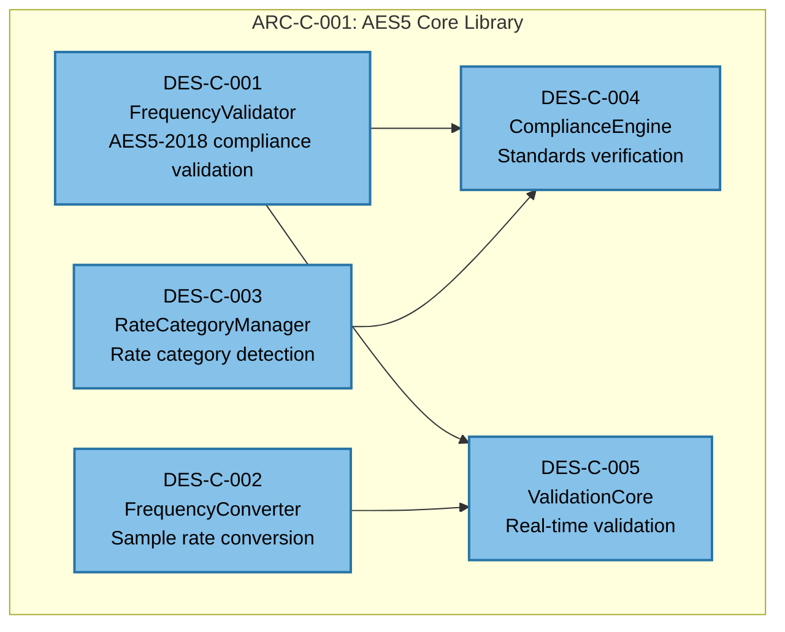

# Software Design Description: AES5 Core Library Component

## 1. Introduction

### 1.1 Purpose

This Software Design Description (SDD) defines the detailed design for ARC-C-001 (AES5 Core Library), the central component implementing AES5-2018 preferred sampling frequencies specification. The design follows IEEE 1016-2009 standards and supports XP Simple Design principles.

### 1.2 Scope

This design covers:

- **Primary Component**: ARC-C-001 AES5 Core Library decomposition into sub-components
- **Core Sub-Components**: DES-C-001 through DES-C-005 with detailed specifications
- **Interface Design**: Internal interfaces supporting dependency injection and testability
- **Data Model Design**: Static allocation-compatible data structures
- **Test-Driven Design**: Interface specifications enabling comprehensive TDD

### 1.3 Traceability

| Architecture Component | Design Components | Requirements Satisfied |
|----------------------|------------------|----------------------|
| **ARC-C-001** | DES-C-001, DES-C-002, DES-C-003 | SYS-FUNC-001, SYS-FUNC-002, SYS-FUNC-003 |
| **ARC-C-001** | DES-C-004, DES-C-005 | SYS-CONST-002, SYS-PERF-001 |

## 2. Component Decomposition

### 2.1 Design Overview

ARC-C-001 (AES5 Core Library) decomposes into five specialized components following Single Responsibility Principle:



### 2.2 Component Responsibilities

| Component ID | Name | Primary Responsibility | Requirements Trace |
|-------------|------|----------------------|-------------------|
| **DES-C-001** | FrequencyValidator | Validate sampling frequencies against AES5-2018 tolerances | SYS-FUNC-001, SYS-FUNC-002 |
| **DES-C-002** | FrequencyConverter | Convert between supported sampling frequencies | SYS-FUNC-003, SYS-PERF-001 |
| **DES-C-003** | RateCategoryManager | Detect and manage frequency rate categories | SYS-FUNC-003 |
| **DES-C-004** | ComplianceEngine | Verify AES5-2018 specification compliance | SYS-CONST-002 |
| **DES-C-005** | ValidationCore | Provide real-time validation services | SYS-PERF-001, SYS-REL-001 |

## 3. Detailed Component Designs

### 3.1 DES-C-001: FrequencyValidator

#### 3.1.1 Component Purpose

**Responsibility**: Validate sampling frequencies against AES5-2018 specification tolerances and categorizations.

**Requirements Satisfied**:
- SYS-FUNC-001.1: 48 kHz frequency validation (±0.1% tolerance)
- SYS-FUNC-002.1: 44.1 kHz frequency validation
- SYS-FUNC-002.2: 96 kHz frequency validation
- SYS-FUNC-002.3: 32 kHz legacy frequency validation

#### 3.1.2 Class Design

```cpp
// DES-C-001: FrequencyValidator
namespace AES5::Core {
    enum class ValidationResult {
        Valid,              // Frequency within AES5-2018 tolerance
        OutOfTolerance,     // Frequency outside ±0.1% tolerance  
        UnsupportedFreq,    // Frequency not in AES5-2018 specification
        InvalidInput        // Invalid frequency value (0, negative, etc.)
    };

    enum class FrequencyType {
        Primary,            // 48 kHz (AES5-2018 Clause 5.1)
        Standard,           // 44.1, 96, 32 kHz (AES5-2018 Clause 5.2)
        Multiple,           // 2×, 4×, 8× variants (AES5-2018 Clause 5.3)
        Legacy,             // Deprecated frequencies for compatibility
        Unknown             // Not recognized frequency
    };

    class FrequencyValidator {
    private:
        // DES-I-001: ComplianceEngine interface dependency
        std::shared_ptr<IComplianceEngine> compliance_engine_;
        
        // Static tolerance table for performance (avoid floating-point)
        struct ToleranceRange {
            uint32_t nominal_freq_hz;
            uint32_t min_freq_hz;      // -0.1% tolerance
            uint32_t max_freq_hz;      // +0.1% tolerance
            FrequencyType type;
        };
        
        static constexpr std::array<ToleranceRange, 8> TOLERANCE_TABLE = {{
            // Primary frequencies (AES5-2018 Clause 5.1)
            {48000, 47952, 48048, FrequencyType::Primary},
            
            // Standard frequencies (AES5-2018 Clause 5.2)
            {44100, 43956, 44244, FrequencyType::Standard},
            {96000, 95904, 96096, FrequencyType::Standard},
            {32000, 31968, 32032, FrequencyType::Legacy},
            
            // Multiple frequencies (AES5-2018 Clause 5.3)
            {88200, 87912, 88488, FrequencyType::Multiple},   // 2×44.1
            {192000, 191808, 192192, FrequencyType::Multiple}, // 2×96
            {176400, 175824, 176976, FrequencyType::Multiple}, // 4×44.1
            {384000, 383616, 384384, FrequencyType::Multiple}  // 4×96
        }};

    public:
        // Constructor with dependency injection for testability
        explicit FrequencyValidator(std::shared_ptr<IComplianceEngine> engine);
        
        // Primary validation interface
        ValidationResult validate_frequency(uint32_t frequency_hz) const noexcept;
        
        // Frequency classification
        FrequencyType classify_frequency(uint32_t frequency_hz) const noexcept;
        
        // AES5-2018 compliance check
        bool is_aes5_compliant(uint32_t frequency_hz) const noexcept;
        
        // Tolerance range query
        std::optional<ToleranceRange> get_tolerance_range(uint32_t frequency_hz) const noexcept;
        
        // Batch validation for efficiency
        std::vector<ValidationResult> validate_frequency_list(
            const std::vector<uint32_t>& frequencies) const noexcept;
    };
}
```

#### 3.1.3 Interface Dependencies

**DES-I-001**: IComplianceEngine interface (to DES-C-004)
```cpp
class IComplianceEngine {
public:
    virtual ~IComplianceEngine() = default;
    virtual bool verify_aes5_clause_compliance(uint32_t frequency_hz, 
                                              const std::string& clause) const = 0;
    virtual std::string get_compliance_report(uint32_t frequency_hz) const = 0;
};
```

#### 3.1.4 Performance Considerations

- **Static Tolerance Table**: Avoids floating-point calculations during validation
- **Constexpr Data**: Compile-time evaluation for maximum performance  
- **Noexcept Methods**: Exception-safe interfaces supporting real-time constraints
- **Batch Validation**: Reduces per-call overhead for multiple frequency validation

### 3.2 DES-C-002: FrequencyConverter

#### 3.2.1 Component Purpose

**Responsibility**: Convert audio samples between supported AES5-2018 sampling frequencies with quality preservation.

**Requirements Satisfied**:
- SYS-FUNC-003.1: Double-rate frequency conversion (2× multiples)
- SYS-FUNC-003.2: Quadruple-rate frequency conversion (4× multiples)  
- SYS-FUNC-003.3: Octuple-rate frequency conversion (8× multiples)
- SYS-PERF-001.1: <5ms latency for simple ratio conversions

#### 3.2.2 Class Design

```cpp
// DES-C-002: FrequencyConverter
namespace AES5::Core {
    enum class ConversionQuality {
        Fast,               // Integer decimation/interpolation, low CPU
        Balanced,           // Linear interpolation, medium quality
        HighQuality,        // Sinc interpolation, high CPU usage
        Professional       // Multi-stage conversion, highest quality
    };

    struct ConversionParams {
        uint32_t input_freq_hz;
        uint32_t output_freq_hz;
        ConversionQuality quality;
        uint16_t channel_count;
        uint16_t sample_size_bits;   // 16, 24, 32
    };

    struct ConversionResult {
        bool success;
        size_t samples_produced;
        uint64_t processing_time_ns;
        std::string error_message;   // Empty if success
    };

    class FrequencyConverter {
    private:
        // DES-I-002: BufferManager interface dependency
        std::shared_ptr<IBufferManager> buffer_manager_;
        
        // DES-I-003: ValidationCore interface dependency
        std::shared_ptr<IValidationCore> validation_core_;
        
        // Conversion algorithm implementations
        class SimpleRatioConverter;      // Integer ratios (48:32 = 3:2)
        class ComplexRatioConverter;     // Non-integer ratios (44.1:48)
        class ResamplingFilter;          // Anti-aliasing filter
        
        std::unique_ptr<SimpleRatioConverter> simple_converter_;
        std::unique_ptr<ComplexRatioConverter> complex_converter_;
        std::unique_ptr<ResamplingFilter> antialiasing_filter_;
        
        // Performance tracking
        mutable std::atomic<uint64_t> total_conversions_{0};
        mutable std::atomic<uint64_t> total_processing_time_ns_{0};

    public:
        // Constructor with dependency injection
        FrequencyConverter(std::shared_ptr<IBufferManager> buffer_mgr,
                          std::shared_ptr<IValidationCore> validation);
        
        // Primary conversion interface
        ConversionResult convert_frequency(
            const ConversionParams& params,
            const void* input_buffer,
            size_t input_samples,
            void* output_buffer,
            size_t output_buffer_capacity) noexcept;
        
        // Conversion capability query
        bool can_convert(uint32_t input_freq_hz, uint32_t output_freq_hz) const noexcept;
        
        // Performance estimation
        uint64_t estimate_processing_time_ns(const ConversionParams& params,
                                           size_t input_samples) const noexcept;
        
        // Conversion ratio calculation
        std::pair<uint32_t, uint32_t> calculate_conversion_ratio(
            uint32_t input_freq_hz, uint32_t output_freq_hz) const noexcept;
        
        // Performance statistics
        double get_average_processing_time_ms() const noexcept;
        uint64_t get_total_conversions() const noexcept;
    };
}
```

#### 3.2.3 Interface Dependencies

**DES-I-002**: IBufferManager interface (to ARC-C-004)
```cpp
class IBufferManager {
public:
    virtual ~IBufferManager() = default;
    virtual void* acquire_buffer(size_t size_bytes) noexcept = 0;
    virtual void release_buffer(void* buffer) noexcept = 0;
    virtual bool is_buffer_available(size_t size_bytes) const noexcept = 0;
};
```

**DES-I-003**: IValidationCore interface (to DES-C-005)
```cpp
class IValidationCore {
public:
    virtual ~IValidationCore() = default;
    virtual bool validate_buffer_format(const void* buffer, size_t samples,
                                      uint16_t channels, uint16_t bits) const noexcept = 0;
    virtual bool validate_conversion_params(const ConversionParams& params) const noexcept = 0;
};
```

### 3.3 DES-C-003: RateCategoryManager

#### 3.3.1 Component Purpose

**Responsibility**: Detect, classify, and manage AES5-2018 frequency rate categories and their mathematical relationships.

**Requirements Satisfied**:
- SYS-FUNC-003.4: Automatic rate category detection
- SYS-FUNC-003.1-3.3: Rate category management (basic, double, quadruple, octuple)

#### 3.3.2 Class Design

```cpp
// DES-C-003: RateCategoryManager
namespace AES5::Core {
    enum class RateCategory {
        Quarter,            // 0.25× base rates (12, 11.025, 8 kHz)
        Half,               // 0.5× base rates (24, 22.05, 16 kHz)
        Basic,              // 1× base rates (48, 44.1, 32 kHz)  
        Double,             // 2× base rates (96, 88.2, 64 kHz)
        Quadruple,          // 4× base rates (192, 176.4, 128 kHz)
        Octuple,            // 8× base rates (384, 352.8, 256 kHz)
        Unknown             // Not a recognized rate category
    };

    struct RateRelationship {
        uint32_t base_frequency_hz;     // Base frequency (48000, 44100, 32000)
        RateCategory category;          // Rate multiplication category
        uint32_t multiplier;            // Integer multiplier from base
        bool is_aes5_compliant;         // AES5-2018 compliance status
    };

    class RateCategoryManager {
    private:
        // DES-I-004: ComplianceEngine interface dependency
        std::shared_ptr<IComplianceEngine> compliance_engine_;
        
        // Static rate calculation tables for performance
        static constexpr std::array<uint32_t, 3> BASE_FREQUENCIES = {48000, 44100, 32000};
        static constexpr std::array<double, 6> RATE_MULTIPLIERS = {0.25, 0.5, 1.0, 2.0, 4.0, 8.0};
        
        // Rate category calculation
        RateRelationship calculate_rate_relationship(uint32_t frequency_hz) const noexcept;
        
        // Mathematical relationship validation  
        bool is_valid_multiple(uint32_t frequency_hz, uint32_t base_hz, 
                             double multiplier) const noexcept;

    public:
        // Constructor with dependency injection
        explicit RateCategoryManager(std::shared_ptr<IComplianceEngine> engine);
        
        // Primary rate detection interface
        RateCategory detect_category(uint32_t frequency_hz) const noexcept;
        
        // Rate relationship analysis
        RateRelationship analyze_frequency(uint32_t frequency_hz) const noexcept;
        
        // Category compatibility checking
        bool are_categories_compatible(RateCategory cat1, RateCategory cat2) const noexcept;
        
        // Base frequency detection
        uint32_t find_base_frequency(uint32_t frequency_hz) const noexcept;
        
        // Rate category enumeration
        std::vector<uint32_t> get_frequencies_in_category(RateCategory category) const;
        
        // Mathematical validation
        bool validate_rate_relationship(uint32_t freq1_hz, uint32_t freq2_hz) const noexcept;
    };
}
```

### 3.4 DES-C-004: ComplianceEngine

#### 3.4.1 Component Purpose

**Responsibility**: Verify comprehensive AES5-2018 specification compliance and generate compliance reports.

**Requirements Satisfied**:
- SYS-CONST-002.1: AES5-2018 strict adherence
- SYS-CONST-002.2: Compliance verification capabilities

#### 3.4.2 Class Design

```cpp
// DES-C-004: ComplianceEngine  
namespace AES5::Core {
    enum class ComplianceLevel {
        FullCompliance,     // 100% AES5-2018 compliant
        MostlyCompliant,    // Minor deviations, functional
        PartialCompliance,  // Significant deviations
        NonCompliant       // Does not meet AES5-2018 requirements
    };

    struct ComplianceCheck {
        std::string clause_reference;   // AES5-2018 clause (e.g., "5.1", "5.2.1")
        std::string description;        // Human-readable check description
        bool passed;                   // Compliance check result
        std::string details;           // Additional information or failure reason
    };

    struct ComplianceReport {
        uint32_t frequency_hz;
        ComplianceLevel overall_level;
        std::vector<ComplianceCheck> checks;
        std::chrono::system_clock::time_point timestamp;
        std::string summary;
    };

    class ComplianceEngine {
    private:
        // Compliance check implementations
        bool check_clause_5_1_primary_frequency(uint32_t frequency_hz) const noexcept;
        bool check_clause_5_2_standard_frequencies(uint32_t frequency_hz) const noexcept;
        bool check_clause_5_3_multiple_frequencies(uint32_t frequency_hz) const noexcept;
        bool check_clause_5_4_legacy_frequencies(uint32_t frequency_hz) const noexcept;
        bool check_tolerance_requirements(uint32_t frequency_hz) const noexcept;
        
        // Compliance report generation
        ComplianceReport generate_detailed_report(uint32_t frequency_hz) const;
        ComplianceLevel calculate_overall_compliance(
            const std::vector<ComplianceCheck>& checks) const noexcept;

    public:
        // Primary compliance verification interface
        bool verify_aes5_clause_compliance(uint32_t frequency_hz, 
                                         const std::string& clause) const noexcept override;
        
        // Comprehensive compliance analysis
        ComplianceReport analyze_frequency_compliance(uint32_t frequency_hz) const;
        
        // Quick compliance check
        ComplianceLevel get_compliance_level(uint32_t frequency_hz) const noexcept;
        
        // Compliance report generation
        std::string get_compliance_report(uint32_t frequency_hz) const override;
        
        // Batch compliance verification
        std::vector<ComplianceReport> analyze_frequency_list(
            const std::vector<uint32_t>& frequencies) const;
        
        // Compliance statistics
        struct ComplianceStats {
            size_t total_checks;
            size_t passed_checks;
            size_t failed_checks;
            double compliance_percentage;
        };
        ComplianceStats get_compliance_statistics(
            const std::vector<uint32_t>& frequencies) const;
    };
}
```

### 3.5 DES-C-005: ValidationCore

#### 3.5.1 Component Purpose

**Responsibility**: Provide real-time validation services with performance monitoring and error recovery.

**Requirements Satisfied**:
- SYS-PERF-001.1: <100μs validation response time
- SYS-REL-001.1: Graceful error recovery
- SYS-REL-001.2: Continuous operation reliability

#### 3.5.2 Class Design

```cpp
// DES-C-005: ValidationCore
namespace AES5::Core {
    enum class ValidationError {
        None,               // No error
        InvalidInput,       // Invalid input parameters
        BufferOverflow,     // Buffer size exceeded
        ProcessingTimeout,  // Validation took too long
        ResourceExhausted, // System resources unavailable
        HardwareError      // Platform hardware issue
    };

    struct ValidationMetrics {
        uint64_t validation_count;
        uint64_t total_time_ns;
        uint64_t max_time_ns;
        uint64_t min_time_ns;
        double average_time_ns;
        uint32_t error_count;
    };

    class ValidationCore {
    private:
        // Performance monitoring
        mutable std::atomic<uint64_t> validation_count_{0};
        mutable std::atomic<uint64_t> total_processing_time_ns_{0};
        mutable std::atomic<uint64_t> max_processing_time_ns_{0};
        mutable std::atomic<uint64_t> min_processing_time_ns_{UINT64_MAX};
        mutable std::atomic<uint32_t> error_count_{0};
        
        // Error recovery state
        mutable std::atomic<ValidationError> last_error_{ValidationError::None};
        
        // Performance timing utilities
        class PerformanceTimer {
            std::chrono::high_resolution_clock::time_point start_time_;
        public:
            PerformanceTimer() : start_time_(std::chrono::high_resolution_clock::now()) {}
            uint64_t elapsed_ns() const {
                auto end = std::chrono::high_resolution_clock::now();
                return std::chrono::duration_cast<std::chrono::nanoseconds>(
                    end - start_time_).count();
            }
        };

    public:
        // Primary validation interfaces
        bool validate_buffer_format(const void* buffer, size_t samples,
                                  uint16_t channels, uint16_t bits) const noexcept override;
        
        bool validate_conversion_params(const ConversionParams& params) const noexcept override;
        
        // Real-time validation with performance monitoring
        ValidationError validate_with_timeout(
            std::function<bool()> validator,
            std::chrono::nanoseconds timeout = std::chrono::microseconds(100)) const noexcept;
        
        // Error state management
        ValidationError get_last_error() const noexcept;
        void clear_error_state() noexcept;
        
        // Performance metrics
        ValidationMetrics get_performance_metrics() const noexcept;
        void reset_performance_metrics() noexcept;
        
        // System health monitoring
        bool is_system_healthy() const noexcept;
        double get_error_rate() const noexcept;
    };
}
```

## 4. Data Model Design

### 4.1 DES-D-001: Audio Buffer Data Model

```cpp
// DES-D-001: Audio Buffer Data Model (Static allocation compatible)
namespace AES5::Data {
    // Maximum constraints for embedded systems
    constexpr size_t MAX_CHANNELS = 8;
    constexpr size_t MAX_SAMPLES_PER_BUFFER = 1024;
    constexpr size_t MAX_SAMPLE_SIZE_BYTES = 4;  // 32-bit samples
    
    struct AudioBufferHeader {
        uint32_t sample_rate_hz;
        uint16_t channel_count;
        uint16_t sample_size_bits;      // 16, 24, 32
        uint16_t sample_format;         // PCM, Float
        size_t sample_count;
        uint64_t timestamp_ns;
        uint32_t buffer_id;             // For tracking/debugging
    };
    
    template<size_t MaxSamples = MAX_SAMPLES_PER_BUFFER,
             size_t MaxChannels = MAX_CHANNELS>
    class StaticAudioBuffer {
    private:
        AudioBufferHeader header_;
        alignas(16) uint8_t data_[MaxSamples * MaxChannels * MAX_SAMPLE_SIZE_BYTES];
        
    public:
        // Buffer access
        void* get_data() noexcept { return data_; }
        const void* get_data() const noexcept { return data_; }
        
        // Header access
        const AudioBufferHeader& get_header() const noexcept { return header_; }
        void set_header(const AudioBufferHeader& header) noexcept { header_ = header; }
        
        // Buffer capacity
        constexpr size_t max_samples() const noexcept { return MaxSamples; }
        constexpr size_t max_channels() const noexcept { return MaxChannels; }
        constexpr size_t buffer_size_bytes() const noexcept { 
            return MaxSamples * MaxChannels * MAX_SAMPLE_SIZE_BYTES; 
        }
    };
}
```

## 5. Test-Driven Design Approach

### 5.1 Test Interface Design

Each component interface designed for comprehensive mocking and TDD:

```cpp
// Test-friendly interface design example
namespace AES5::Testing {
    // Mock interface for DES-C-001 testing
    class MockComplianceEngine : public IComplianceEngine {
    private:
        mutable std::vector<std::pair<uint32_t, std::string>> call_log_;
        std::map<std::pair<uint32_t, std::string>, bool> expected_results_;
        
    public:
        // Mock configuration
        void expect_compliance_call(uint32_t freq, const std::string& clause, bool result) {
            expected_results_[{freq, clause}] = result;
        }
        
        // Interface implementation
        bool verify_aes5_clause_compliance(uint32_t frequency_hz, 
                                         const std::string& clause) const override {
            call_log_.emplace_back(frequency_hz, clause);
            auto it = expected_results_.find({frequency_hz, clause});
            return it != expected_results_.end() ? it->second : false;
        }
        
        // Test verification
        std::vector<std::pair<uint32_t, std::string>> get_call_log() const { return call_log_; }
        void reset_call_log() { call_log_.clear(); }
    };
}
```

### 5.2 Design-to-Test Traceability

| Design Component | Test Categories | Test IDs (Planned) |
|-----------------|----------------|-------------------|
| **DES-C-001** | Unit, Integration, Performance | TEST-U-001, TEST-I-001, TEST-P-001 |
| **DES-C-002** | Unit, Integration, Performance, Compliance | TEST-U-002, TEST-I-002, TEST-P-002, TEST-C-001 |
| **DES-C-003** | Unit, Integration, Mathematical | TEST-U-003, TEST-I-003, TEST-M-001 |
| **DES-C-004** | Unit, Compliance, Standards | TEST-U-004, TEST-C-002, TEST-S-001 |
| **DES-C-005** | Unit, Performance, Real-time | TEST-U-005, TEST-P-003, TEST-RT-001 |

---

**Document Control:**
- **Version:** 0.1.0 (Draft)  
- **Created:** 2025-11-06
- **Status:** Ready for review and Phase 5 implementation preparation
- **Next Phase:** Phase 5 Implementation with TDD approach
- **Traceability Verified:** ARC-C-001 → DES-C-001 through DES-C-005 → TEST-* (planned)