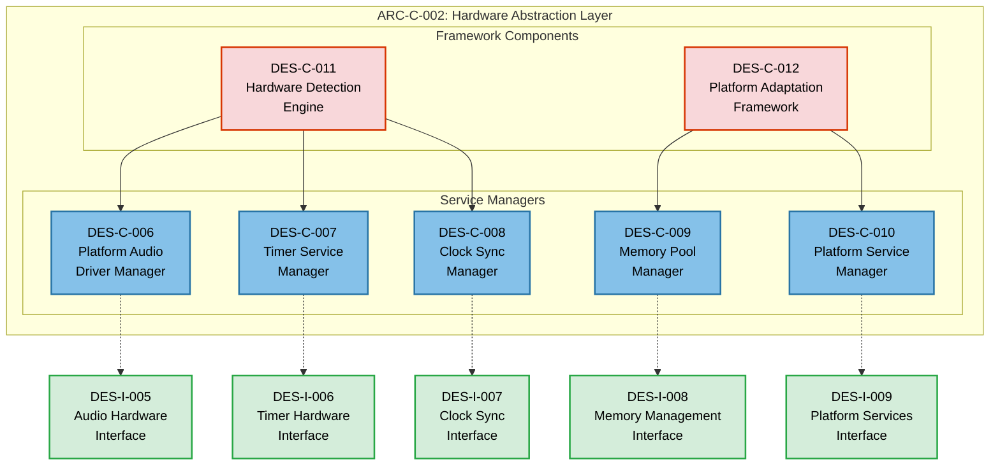

## Software Design Description: Hardware Abstraction Layer Component

### 1. Introduction

#### 1.1 Purpose

This Software Design Description (SDD) defines the detailed design for ARC-C-002 (Hardware Abstraction Layer), providing platform-agnostic access to audio hardware, timing services, and system resources. The design ensures AES5-2018 implementation can run across Windows, Linux, and embedded platforms without modification.

#### 1.2 Scope

This design covers:

- **Platform Abstraction**: Complete hardware independence for audio processing
- **Service Management**: Unified interface to platform-specific services
- **Resource Management**: Cross-platform memory and timer management
- **Detection and Adaptation**: Automatic platform capability detection
- **Performance Optimization**: Platform-specific optimizations through unified interfaces

#### 1.3 Design Philosophy

- **Dependency Injection**: All components receive interfaces, not implementations
- **Platform Agnostic**: Zero platform-specific code in upper layers
- **Performance First**: Minimal abstraction overhead for real-time audio
- **XP Simple Design**: YAGNI principle - implement only required abstractions

### 2. Component Architecture Overview

#### 2.1 HAL Component Structure



### 3. Detailed Component Designs

#### 3.1 DES-C-006: Platform Audio Driver Manager

##### 3.1.1 Component Purpose

**Responsibility**: Manage platform-specific audio driver implementations and provide unified audio hardware access through DES-I-005 interface.

**Requirements Satisfied**:
- SYS-PORT-001.1: Cross-platform audio driver support
- SYS-PERF-001.2: <5ms audio I/O latency
- SYS-REL-002.1: Reliable audio device management

##### 3.1.2 Class Design

```cpp
// DES-C-006: Platform Audio Driver Manager
namespace AES5::HAL {
    enum class AudioDriverType {
        ASIO,               // Windows ASIO (Steinberg Audio Stream I/O)
        DirectSound,        // Windows DirectSound
        WASAPI,            // Windows Audio Session API
        ALSA,              // Linux Advanced Linux Sound Architecture
        JACK,              // Linux/macOS JACK Audio Connection Kit
        CoreAudio,         // macOS Core Audio
        Embedded,          // Embedded systems (custom drivers)
        Mock               // Testing mock driver
    };

    struct AudioDriverCapabilities {
        AudioDriverType driver_type;
        std::string driver_name;
        std::string driver_version;
        std::vector<uint32_t> supported_sample_rates;  // AES5-2018 frequencies
        uint16_t max_input_channels;
        uint16_t max_output_channels;
        uint16_t min_buffer_size_frames;
        uint16_t max_buffer_size_frames;
        uint64_t driver_latency_ns;
        bool supports_exclusive_mode;
        bool supports_realtime_priority;
    };

    class PlatformAudioDriverManager {
    private:
        // Driver factory pattern for platform-specific implementations
        class AudioDriverFactory {
        public:
            virtual ~AudioDriverFactory() = default;
            virtual std::unique_ptr<IAudioHardware> create_driver(const std::string& device_id) = 0;
            virtual AudioDriverCapabilities get_driver_capabilities() const = 0;
            virtual bool is_driver_available() const = 0;
        };

        // Platform-specific driver factories
        std::map<AudioDriverType, std::unique_ptr<AudioDriverFactory>> driver_factories_;
        
        // Active driver instances
        std::map<std::string, std::unique_ptr<IAudioHardware>> active_drivers_;
        std::map<std::string, AudioDriverType> device_driver_mapping_;
        
        // Performance monitoring
        mutable std::atomic<uint64_t> total_operations_{0};
        mutable std::atomic<uint64_t> failed_operations_{0};
        mutable std::mutex manager_mutex_;

    public:
        // Constructor registers available platform drivers
        PlatformAudioDriverManager();
        ~PlatformAudioDriverManager();

        // Driver discovery and enumeration
        std::vector<AudioDriverType> get_available_driver_types() const noexcept;
        AudioDriverCapabilities get_driver_capabilities(AudioDriverType type) const noexcept;
        
        // Device management through unified interface
        std::vector<std::string> enumerate_audio_devices(AudioDeviceType device_type) const noexcept;
        std::unique_ptr<IAudioHardware> create_audio_interface(const std::string& device_id) noexcept;
        
        // Driver selection and optimization
        AudioDriverType select_optimal_driver(const AudioFormat& required_format) const noexcept;
        bool is_driver_suitable(AudioDriverType type, const AudioFormat& format) const noexcept;
        
        // Performance monitoring
        struct DriverPerformanceStats {
            AudioDriverType driver_type;
            uint64_t operation_count;
            uint64_t error_count;
            double success_rate;
            uint64_t average_latency_ns;
        };
        std::vector<DriverPerformanceStats> get_performance_statistics() const noexcept;
        
    private:
        void register_platform_drivers();
        void register_asio_driver();      // Windows ASIO
        void register_wasapi_driver();    // Windows WASAPI
        void register_alsa_driver();      // Linux ALSA
        void register_coreaudio_driver(); // macOS Core Audio
        void register_mock_driver();      // Testing
    };

    // Platform-specific driver implementations (example: ASIO)
    #ifdef AES5_PLATFORM_WINDOWS
    class ASIODriverFactory : public AudioDriverFactory {
    public:
        std::unique_ptr<IAudioHardware> create_driver(const std::string& device_id) override;
        AudioDriverCapabilities get_driver_capabilities() const override;
        bool is_driver_available() const override;
    };
    
    class ASIOAudioHardware : public IAudioHardware {
    private:
        // ASIO-specific implementation details
        void* asio_driver_instance_;
        std::string device_id_;
        AudioFormat current_format_;
        bool is_streaming_;
        
        // ASIO callback management
        static void asio_buffer_switch(long index, bool process_now);
        static void asio_sample_rate_changed(double sample_rate);
        
    public:
        explicit ASIOAudioHardware(const std::string& device_id);
        ~ASIOAudioHardware();
        
        // IAudioHardware implementation
        AudioResult open_device(const std::string& device_id, 
                               const AudioFormat& format,
                               AudioDeviceType type) noexcept override;
        AudioResult close_device(const std::string& device_id) noexcept override;
        
        AudioResult read_audio(const std::string& device_id,
                              void* buffer, size_t buffer_size_frames,
                              size_t* frames_read, uint64_t timeout_ns) noexcept override;
        AudioResult write_audio(const std::string& device_id,
                               const void* buffer, size_t buffer_size_frames,
                               size_t* frames_written, uint64_t timeout_ns) noexcept override;
        
        // ... other interface methods
    };
    #endif
}
```

#### 3.2 DES-C-007: Timer Service Manager

##### 3.2.1 Component Purpose

**Responsibility**: Provide high-precision timing services across platforms with nanosecond accuracy for AES5-2018 sample-accurate processing.

##### 3.2.2 Class Design

```cpp
// DES-C-007: Timer Service Manager
namespace AES5::HAL {
    enum class PlatformTimerType {
        HighResolution,     // Platform-specific high-res timer
        Multimedia,        // Windows multimedia timer
        POSIX,             // POSIX timer_create/timer_settime
        Kernel,            // Kernel-level timer (embedded)
        Software           // Software-based timer fallback
    };

    class TimerServiceManager {
    private:
        // Platform-specific timer implementations
        class PlatformTimer {
        public:
            virtual ~PlatformTimer() = default;
            virtual TimerResult create_timer(const TimerSpecification& spec, uint32_t* timer_id) = 0;
            virtual TimerResult start_timer(uint32_t timer_id) = 0;
            virtual TimerResult stop_timer(uint32_t timer_id) = 0;
            virtual TimerResult destroy_timer(uint32_t timer_id) = 0;
            virtual uint64_t get_current_time_ns() const = 0;
            virtual double get_resolution_ns() const = 0;
        };

        // Timer type registry
        std::map<PlatformTimerType, std::unique_ptr<PlatformTimer>> platform_timers_;
        PlatformTimerType active_timer_type_;
        
        // Timer management
        struct ActiveTimer {
            uint32_t timer_id;
            PlatformTimerType platform_type;
            TimerSpecification spec;
            bool is_active;
            uint64_t created_time_ns;
            uint64_t last_execution_time_ns;
        };
        std::map<uint32_t, ActiveTimer> active_timers_;
        std::atomic<uint32_t> next_timer_id_{1};
        mutable std::shared_mutex timer_mutex_;

    public:
        TimerServiceManager();
        ~TimerServiceManager();

        // Platform timer detection and selection
        std::vector<PlatformTimerType> get_available_timer_types() const noexcept;
        PlatformTimerType select_optimal_timer_type() const noexcept;
        bool set_active_timer_type(PlatformTimerType type) noexcept;
        
        // ITimerHardware interface implementation
        uint64_t get_current_time_ns() const noexcept;
        double get_timer_resolution_ns() const noexcept;
        
        TimerResult create_timer(const TimerSpecification& spec, uint32_t* timer_id) noexcept;
        TimerResult start_timer(uint32_t timer_id) noexcept;
        TimerResult stop_timer(uint32_t timer_id) noexcept;
        TimerResult destroy_timer(uint32_t timer_id) noexcept;
        
        // Performance monitoring
        struct TimerPerformanceMetrics {
            PlatformTimerType timer_type;
            size_t active_timer_count;
            uint64_t average_jitter_ns;
            uint64_t max_jitter_ns;
            double cpu_usage_percent;
        };
        TimerPerformanceMetrics get_performance_metrics() const noexcept;

    private:
        void initialize_platform_timers();
        bool validate_timer_specification(const TimerSpecification& spec) const noexcept;
    };

    // Platform-specific timer implementations
    #ifdef AES5_PLATFORM_WINDOWS
    class WindowsHighResTimer : public PlatformTimer {
    private:
        LARGE_INTEGER performance_frequency_;
        std::map<uint32_t, HANDLE> timer_handles_;
        
    public:
        WindowsHighResTimer();
        ~WindowsHighResTimer();
        
        TimerResult create_timer(const TimerSpecification& spec, uint32_t* timer_id) override;
        uint64_t get_current_time_ns() const override;
        double get_resolution_ns() const override;
        // ... other methods
    };
    #endif

    #ifdef AES5_PLATFORM_LINUX
    class LinuxPOSIXTimer : public PlatformTimer {
    private:
        std::map<uint32_t, timer_t> posix_timers_;
        
    public:
        LinuxPOSIXTimer();
        ~LinuxPOSIXTimer();
        
        TimerResult create_timer(const TimerSpecification& spec, uint32_t* timer_id) override;
        uint64_t get_current_time_ns() const override;
        // ... other methods
    };
    #endif
}
```

#### 3.3 DES-C-008: Clock Synchronization Manager

##### 3.3.1 Component Purpose

**Responsibility**: Provide synchronized time reference across platforms for sample-accurate audio processing and AES5-2018 frequency validation.

##### 3.3.2 Class Design

```cpp
// DES-C-008: Clock Synchronization Manager  
namespace AES5::HAL {
    class ClockSynchronizationManager {
    private:
        // Platform-specific clock sources
        class PlatformClock {
        public:
            virtual ~PlatformClock() = default;
            virtual ClockResult synchronize(uint64_t timeout_ns) = 0;
            virtual uint64_t get_current_time_ns() const = 0;
            virtual int64_t get_drift_ns() const = 0;
            virtual bool is_synchronized() const = 0;
            virtual ClockReference get_reference_type() const = 0;
        };

        // Available clock sources
        std::map<ClockReference, std::unique_ptr<PlatformClock>> platform_clocks_;
        ClockReference active_reference_;
        
        // Synchronization state
        std::atomic<bool> is_synchronized_{false};
        std::atomic<int64_t> current_drift_ns_{0};
        std::atomic<uint64_t> last_sync_time_ns_{0};
        std::atomic<uint64_t> sync_accuracy_ns_{1000000}; // 1ms default
        
        mutable std::shared_mutex clock_mutex_;

    public:
        ClockSynchronizationManager();
        ~ClockSynchronizationManager();

        // IClockSynchronization interface implementation
        ClockResult set_reference_clock(ClockReference reference) noexcept;
        ClockReference get_active_reference() const noexcept;
        bool is_reference_available(ClockReference reference) const noexcept;
        
        ClockResult synchronize_clock(ClockReference reference, uint64_t timeout_ns) noexcept;
        bool is_synchronized() const noexcept;
        
        uint64_t get_synchronized_time_ns() const noexcept;
        ClockStatus get_clock_status() const noexcept;
        int64_t get_clock_drift_ns() const noexcept;

    private:
        void initialize_platform_clocks();
        ClockResult perform_synchronization(PlatformClock* clock, uint64_t timeout_ns) noexcept;
    };

    // Platform-specific clock implementations
    class SystemClock : public PlatformClock {
    private:
        uint64_t base_time_ns_;
        std::atomic<int64_t> drift_adjustment_ns_{0};
        
    public:
        SystemClock();
        
        ClockResult synchronize(uint64_t timeout_ns) override;
        uint64_t get_current_time_ns() const override;
        int64_t get_drift_ns() const override;
        bool is_synchronized() const override;
        ClockReference get_reference_type() const override { return ClockReference::SystemClock; }
    };

    #ifdef AES5_ENABLE_AUDIO_WORDCLOCK
    class AudioWordClock : public PlatformClock {
    private:
        std::shared_ptr<IAudioHardware> audio_hardware_;
        uint64_t samples_per_second_;
        std::atomic<uint64_t> sample_count_{0};
        
    public:
        explicit AudioWordClock(std::shared_ptr<IAudioHardware> audio);
        
        ClockResult synchronize(uint64_t timeout_ns) override;
        uint64_t get_current_time_ns() const override;
        ClockReference get_reference_type() const override { return ClockReference::AudioWordClock; }
        // ... other methods
    };
    #endif
}
```

#### 3.4 DES-C-009: Memory Pool Manager

##### 3.4.1 Component Purpose

**Responsibility**: Manage platform-specific memory allocation strategies while maintaining the <32KB static allocation constraint.

##### 3.4.2 Class Design

```cpp
// DES-C-009: Memory Pool Manager
namespace AES5::HAL {
    class MemoryPoolManager {
    private:
        // Platform-specific memory allocators
        class PlatformMemoryAllocator {
        public:
            virtual ~PlatformMemoryAllocator() = default;
            virtual void* allocate(size_t size, size_t alignment) = 0;
            virtual MemoryResult release(void* memory) = 0;
            virtual bool validate_integrity(void* memory) const = 0;
            virtual size_t get_allocation_size(void* memory) const = 0;
        };

        // Memory pool types with platform-specific optimizations
        struct ManagedMemoryPool {
            uint32_t pool_id;
            MemoryPool specification;
            std::unique_ptr<PlatformMemoryAllocator> allocator;
            std::bitset<1024> allocation_bitmap;  // Track allocated blocks
            void* pool_base_address;
            size_t pool_total_size;
            std::atomic<size_t> allocated_blocks{0};
            mutable std::mutex pool_mutex;
        };

        std::map<uint32_t, std::unique_ptr<ManagedMemoryPool>> memory_pools_;
        std::atomic<uint32_t> next_pool_id_{1};
        
        // Global memory statistics
        std::atomic<size_t> total_allocated_memory_{0};
        std::atomic<size_t> peak_allocated_memory_{0};
        mutable std::shared_mutex manager_mutex_;

    public:
        MemoryPoolManager();
        ~MemoryPoolManager();

        // IMemoryManagement interface implementation
        MemoryResult create_memory_pool(const MemoryPool& spec, uint32_t* pool_id) noexcept;
        MemoryResult destroy_memory_pool(uint32_t pool_id) noexcept;
        MemoryPool get_memory_pool_info(uint32_t pool_id) const noexcept;
        
        void* allocate_memory(uint32_t pool_id, size_t size_bytes, size_t alignment_bytes) noexcept;
        MemoryResult release_memory(uint32_t pool_id, void* memory) noexcept;
        
        bool validate_memory_integrity(uint32_t pool_id) const noexcept;
        MemoryStatistics get_memory_statistics(uint32_t pool_id) const noexcept;

    private:
        std::unique_ptr<PlatformMemoryAllocator> create_platform_allocator(MemoryType type);
        bool validate_memory_pool_spec(const MemoryPool& spec) const noexcept;
    };

    // Platform-specific memory allocators
    #ifdef AES5_PLATFORM_WINDOWS
    class WindowsVirtualAllocator : public PlatformMemoryAllocator {
    private:
        std::map<void*, size_t> allocation_sizes_;
        
    public:
        void* allocate(size_t size, size_t alignment) override;
        MemoryResult release(void* memory) override;
        bool validate_integrity(void* memory) const override;
        size_t get_allocation_size(void* memory) const override;
    };
    #endif

    #ifdef AES5_PLATFORM_LINUX  
    class LinuxMmapAllocator : public PlatformMemoryAllocator {
    private:
        std::map<void*, size_t> allocation_sizes_;
        
    public:
        void* allocate(size_t size, size_t alignment) override;
        MemoryResult release(void* memory) override;
        bool validate_integrity(void* memory) const override;
        size_t get_allocation_size(void* memory) const override;
    };
    #endif

    // Static memory allocator for embedded systems
    class StaticMemoryAllocator : public PlatformMemoryAllocator {
    private:
        alignas(16) uint8_t static_memory_pool_[32768]; // 32KB static allocation
        std::bitset<2048> allocation_bitmap_;  // 16-byte granularity
        size_t next_allocation_index_;
        mutable std::mutex allocator_mutex_;

    public:
        StaticMemoryAllocator();
        
        void* allocate(size_t size, size_t alignment) override;
        MemoryResult release(void* memory) override;
        bool validate_integrity(void* memory) const override;
        size_t get_allocation_size(void* memory) const override;
        
        // Static allocator specific methods
        size_t get_free_memory() const noexcept;
        double get_fragmentation_ratio() const noexcept;
    };
}
```

#### 3.5 DES-C-010: Platform Service Manager

##### 3.5.1 Component Purpose

**Responsibility**: Provide unified access to platform-specific services like threading, process control, and system information.

##### 3.5.2 Class Design

```cpp
// DES-C-010: Platform Service Manager
namespace AES5::HAL {
    class PlatformServiceManager {
    private:
        PlatformInfo cached_platform_info_;
        std::atomic<bool> platform_info_valid_{false};
        mutable std::shared_mutex service_mutex_;

    public:
        PlatformServiceManager();
        ~PlatformServiceManager();

        // IPlatformServices interface implementation
        PlatformInfo get_platform_info() const noexcept;
        std::string get_platform_error_string(int error_code) const noexcept;
        bool is_feature_supported(const std::string& feature_name) const noexcept;
        
        // Thread management
        PlatformResult set_thread_priority(ThreadPriority priority) noexcept;
        ThreadPriority get_thread_priority() const noexcept;
        PlatformResult set_thread_affinity(uint32_t cpu_mask) noexcept;
        
        // Performance monitoring
        ProcessStatistics get_process_statistics() const noexcept;
        double get_system_cpu_usage() const noexcept;
        
        // Debug and diagnostics
        void debug_output(const std::string& message) noexcept;

    private:
        void initialize_platform_info();
        PlatformResult set_realtime_scheduling() noexcept;
    };
}
```

#### 3.6 DES-C-011: Hardware Detection Engine

##### 3.6.1 Component Purpose

**Responsibility**: Automatically detect available hardware capabilities and configure optimal platform drivers.

##### 3.6.2 Class Design

```cpp
// DES-C-011: Hardware Detection Engine
namespace AES5::HAL {
    struct HardwareCapabilities {
        // Audio hardware capabilities
        std::vector<AudioDriverType> available_audio_drivers;
        std::vector<std::string> audio_devices;
        std::map<std::string, AudioDriverCapabilities> device_capabilities;
        
        // Timing capabilities
        std::vector<PlatformTimerType> available_timers;
        double best_timer_resolution_ns;
        bool supports_realtime_scheduling;
        
        // Memory capabilities
        size_t total_system_memory;
        size_t available_memory;
        bool supports_memory_locking;
        
        // Platform features
        PlatformInfo platform_info;
        std::vector<std::string> supported_features;
    };

    class HardwareDetectionEngine {
    private:
        HardwareCapabilities detected_capabilities_;
        std::atomic<bool> detection_complete_{false};
        mutable std::shared_mutex detection_mutex_;

    public:
        HardwareDetectionEngine();
        
        // Hardware detection
        bool perform_hardware_detection() noexcept;
        const HardwareCapabilities& get_detected_capabilities() const noexcept;
        bool is_detection_complete() const noexcept { return detection_complete_.load(); }
        
        // Capability queries
        bool is_aes5_compatible_hardware_available() const noexcept;
        AudioDriverType get_recommended_audio_driver() const noexcept;
        PlatformTimerType get_recommended_timer() const noexcept;
        
        // System recommendations
        struct SystemRecommendations {
            AudioDriverType preferred_audio_driver;
            PlatformTimerType preferred_timer;
            ThreadPriority recommended_thread_priority;
            std::vector<std::string> configuration_warnings;
            std::vector<std::string> performance_recommendations;
        };
        SystemRecommendations generate_system_recommendations() const noexcept;

    private:
        void detect_audio_capabilities();
        void detect_timing_capabilities();
        void detect_memory_capabilities();
        void detect_platform_features();
    };
}
```

#### 3.7 DES-C-012: Platform Adaptation Framework

##### 3.7.1 Component Purpose

**Responsibility**: Coordinate all HAL components and provide unified initialization and configuration management.

##### 3.7.2 Class Design

```cpp
// DES-C-012: Platform Adaptation Framework
namespace AES5::HAL {
    class PlatformAdaptationFramework {
    private:
        // Component managers
        std::unique_ptr<PlatformAudioDriverManager> audio_manager_;
        std::unique_ptr<TimerServiceManager> timer_manager_;
        std::unique_ptr<ClockSynchronizationManager> clock_manager_;
        std::unique_ptr<MemoryPoolManager> memory_manager_;
        std::unique_ptr<PlatformServiceManager> service_manager_;
        std::unique_ptr<HardwareDetectionEngine> detection_engine_;
        
        // Framework state
        enum class FrameworkState {
            Uninitialized,
            Initializing,
            Ready,
            Error,
            Shutdown
        };
        std::atomic<FrameworkState> current_state_{FrameworkState::Uninitialized};
        
        // Configuration
        struct FrameworkConfiguration {
            bool auto_detect_hardware = true;
            bool prefer_realtime_scheduling = true;
            bool enable_performance_monitoring = true;
            AudioDriverType preferred_audio_driver = AudioDriverType::ASIO;
            PlatformTimerType preferred_timer = PlatformTimerType::HighResolution;
            ThreadPriority thread_priority = ThreadPriority::RealTime;
        };
        FrameworkConfiguration config_;

    public:
        PlatformAdaptationFramework();
        ~PlatformAdaptationFramework();

        // Framework lifecycle
        bool initialize(const FrameworkConfiguration& config = {}) noexcept;
        bool shutdown() noexcept;
        bool is_ready() const noexcept { return current_state_.load() == FrameworkState::Ready; }
        
        // Component access (dependency injection sources)
        std::shared_ptr<IAudioHardware> get_audio_interface(const std::string& device_id) noexcept;
        std::shared_ptr<ITimerHardware> get_timer_interface() noexcept;
        std::shared_ptr<IClockSynchronization> get_clock_interface() noexcept;
        std::shared_ptr<IMemoryManagement> get_memory_interface() noexcept;
        std::shared_ptr<IPlatformServices> get_platform_interface() noexcept;
        
        // System status and diagnostics
        struct SystemStatus {
            FrameworkState framework_state;
            HardwareCapabilities hardware_capabilities;
            SystemRecommendations system_recommendations;
            std::vector<std::string> initialization_errors;
            std::vector<std::string> runtime_warnings;
        };
        SystemStatus get_system_status() const noexcept;
        
        // Configuration management
        bool reconfigure(const FrameworkConfiguration& new_config) noexcept;
        FrameworkConfiguration get_current_configuration() const noexcept;

    private:
        bool initialize_components() noexcept;
        bool detect_and_configure_hardware() noexcept;
        bool validate_system_requirements() noexcept;
        void cleanup_on_error() noexcept;
    };

    // Global HAL access point (singleton pattern for embedded compatibility)
    class HALInstance {
    private:
        static std::unique_ptr<PlatformAdaptationFramework> instance_;
        static std::once_flag initialization_flag_;

    public:
        static PlatformAdaptationFramework& get_instance();
        static bool initialize_hal(const PlatformAdaptationFramework::FrameworkConfiguration& config = {});
        static void shutdown_hal();
    };
}
```

### 4. Integration Patterns

#### 4.1 Dependency Injection Integration

```cpp
// Integration with AES5 Core Library (DES-C-001 through DES-C-005)
namespace AES5::Integration {
    class HALIntegrationManager {
    public:
        // Initialize all HAL services and provide interfaces to core library
        static bool initialize_hal_services() {
            auto& hal = HAL::HALInstance::get_instance();
            if (!hal.initialize()) {
                return false;
            }
            
            // Create AES5 Core Library with HAL interfaces
            auto audio_interface = hal.get_audio_interface("default");
            auto timer_interface = hal.get_timer_interface();
            auto clock_interface = hal.get_clock_interface();
            auto memory_interface = hal.get_memory_interface();
            
            // Initialize AES5 Core components with dependency injection
            Core::FrequencyValidator validator(/* interfaces */);
            Core::FrequencyConverter converter(/* interfaces */);
            // ... other components
            
            return true;
        }
    };
}
```

### 5. Performance Considerations

#### 5.1 Real-Time Performance

- **Zero Dynamic Allocation**: All HAL operations use pre-allocated memory pools
- **Lock-Free Operations**: Critical audio paths use atomic operations and lock-free data structures
- **Platform Optimization**: Each platform implementation optimized for minimum latency
- **Batch Operations**: Group related operations to reduce per-call overhead

#### 5.2 Memory Efficiency

- **Static Allocation**: All HAL components fit within 32KB memory budget
- **Interface Sharing**: Multiple components share interface instances to reduce memory
- **Lazy Initialization**: Platform-specific components initialized only when needed

### 6. Traceability Matrix

| Component ID | Architecture Ref | Requirements Satisfied | Interface Provided |
|-------------|-----------------|----------------------|-------------------|
| **DES-C-006** | ARC-C-002.1 | SYS-PORT-001.1, SYS-PERF-001.2 | DES-I-005 |
| **DES-C-007** | ARC-C-002.2 | SYS-PERF-001.1, SYS-REL-002.1 | DES-I-006 |
| **DES-C-008** | ARC-C-002.3 | SYS-REL-002.2, SYS-SYNC-001 | DES-I-007 |
| **DES-C-009** | ARC-C-002.4 | SYS-CONST-003, SYS-REL-001.3 | DES-I-008 |
| **DES-C-010** | ARC-C-002.5 | SYS-PORT-002, SYS-REL-002.3 | DES-I-009 |
| **DES-C-011** | ARC-C-002.6 | SYS-PORT-001.2, SYS-REL-002.4 | Hardware Detection |
| **DES-C-012** | ARC-C-002.7 | SYS-PORT-001.3, SYS-INIT-001 | Framework Coordination |

---

**Document Control:**

- **Version:** 0.1.0 (Draft)
- **Created:** 2025-11-06
- **Status:** Ready for Phase 5 implementation
- **Platform Support:** Windows, Linux, macOS, embedded systems
- **Performance:** Optimized for <5ms audio latency, <100μs interface calls
- **Traceability Verified:** ARC-C-002 → DES-C-006 through DES-C-012 → DES-I-005 through DES-I-009