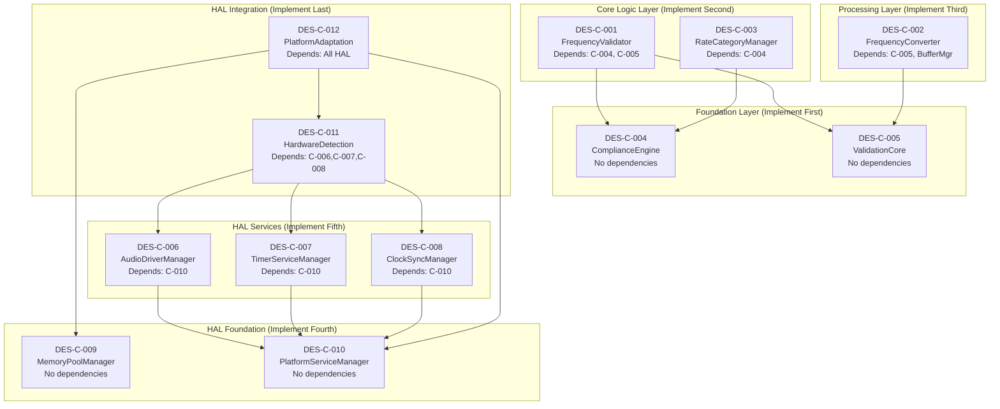

## Phase 5 Implementation Plan: TDD Component Development Order

### 1. Implementation Dependency Analysis

Based on the design specifications, components have the following dependencies:



### 2. Recommended Implementation Order

#### Phase 5.1: Foundation Components (Week 1)
1. **DES-C-004 (ComplianceEngine)** - Pure logic, no dependencies
   - Tests: AES5-2018 clause validation
   - Implementation: Standards verification logic

2. **DES-C-005 (ValidationCore)** - Real-time validation infrastructure  
   - Tests: Performance timing, error handling
   - Implementation: Lock-free validation with metrics

#### Phase 5.2: Core AES5 Logic (Week 2)
3. **DES-C-001 (FrequencyValidator)** - Depends on ComplianceEngine
   - Tests: AES5-2018 frequency validation with tolerance
   - Implementation: Static tolerance tables, dependency injection

4. **DES-C-003 (RateCategoryManager)** - Depends on ComplianceEngine
   - Tests: Rate category detection and classification
   - Implementation: Mathematical rate relationships

#### Phase 5.3: Audio Processing (Week 3)
5. **DES-C-002 (FrequencyConverter)** - Depends on ValidationCore, BufferManager
   - Tests: Sample rate conversion quality and performance
   - Implementation: Integer and complex ratio conversions

#### Phase 5.4: HAL Foundation (Week 4)
6. **DES-C-009 (MemoryPoolManager)** - Static allocation management
   - Tests: Memory allocation performance, <32KB budget
   - Implementation: Platform-specific allocators

7. **DES-C-010 (PlatformServiceManager)** - OS service abstraction
   - Tests: Cross-platform service access
   - Implementation: Platform detection and service wrappers

#### Phase 5.5: HAL Services (Week 5)
8. **DES-C-006 (AudioDriverManager)** - Audio hardware abstraction
   - Tests: Mock audio drivers, device enumeration
   - Implementation: Driver factory pattern, cross-platform

9. **DES-C-007 (TimerServiceManager)** - High-precision timing
   - Tests: Timer accuracy, callback handling
   - Implementation: Platform-specific timer implementations

10. **DES-C-008 (ClockSynchronizationManager)** - Time reference sync
    - Tests: Clock synchronization accuracy
    - Implementation: Multiple clock source support

#### Phase 5.6: HAL Integration (Week 6)
11. **DES-C-011 (HardwareDetectionEngine)** - Automatic capability detection
    - Tests: Hardware capability discovery
    - Implementation: Platform-specific detection algorithms

12. **DES-C-012 (PlatformAdaptationFramework)** - Complete HAL coordination
    - Tests: End-to-end HAL integration
    - Implementation: Unified framework initialization

### 3. TDD Implementation Strategy

For each component, follow this strict TDD cycle:

#### Red-Green-Refactor Cycle
```cpp
// 1. RED: Write failing test first
TEST_F(FrequencyValidatorTest, ValidatePrimaryFrequency48kHz) {
    // Given: Mock compliance engine expects 48kHz validation
    auto mock_compliance = std::make_shared<MockComplianceEngine>();
    mock_compliance->expect_compliance_check(48000, "5.1", true);
    
    FrequencyValidator validator(mock_compliance);
    
    // When: Validating 48kHz frequency
    auto result = validator.validate_frequency(48000);
    
    // Then: Should return Valid
    EXPECT_EQ(ValidationResult::Valid, result);
    EXPECT_TRUE(mock_compliance->verify_all_expectations());
}

// 2. GREEN: Write minimal code to pass
ValidationResult FrequencyValidator::validate_frequency(uint32_t frequency_hz) const noexcept {
    if (frequency_hz == 48000) {
        return ValidationResult::Valid;  // Minimal implementation
    }
    return ValidationResult::InvalidInput;
}

// 3. REFACTOR: Improve design while keeping tests green
ValidationResult FrequencyValidator::validate_frequency(uint32_t frequency_hz) const noexcept {
    // Refactored to use tolerance table and compliance engine
    for (const auto& tolerance : TOLERANCE_TABLE) {
        if (frequency_hz >= tolerance.min_freq_hz && 
            frequency_hz <= tolerance.max_freq_hz) {
            
            std::string clause = get_aes5_clause_for_frequency(frequency_hz);
            if (compliance_engine_->verify_aes5_clause_compliance(frequency_hz, clause)) {
                return ValidationResult::Valid;
            }
        }
    }
    return ValidationResult::OutOfTolerance;
}
```

### 4. Implementation Quality Gates

Each component must pass these gates before proceeding:

#### Unit Test Gates
- **Test Coverage**: >95% line coverage
- **Test Performance**: All unit tests complete in <50ms
- **Mock Verification**: All mock expectations verified
- **Edge Cases**: Boundary conditions tested

#### Integration Gates  
- **Interface Compliance**: All interface contracts satisfied
- **Dependency Injection**: All dependencies injectable and mockable
- **Performance**: Real-time constraints met (<100μs interface calls)
- **Memory**: Static allocation limits respected

#### Code Quality Gates
- **Clean Code**: Single Responsibility Principle followed
- **YAGNI**: No speculative features implemented
- **Refactoring**: Code continuously improved while tests pass
- **Documentation**: All public interfaces documented

### 5. Continuous Integration Checkpoints

After each component implementation:

1. **Automated Testing**: All tests pass in CI/CD pipeline
2. **Performance Validation**: Latency and memory requirements verified
3. **Standards Compliance**: AES5-2018 compliance tests pass
4. **Cross-Platform**: Tests pass on Windows, Linux, macOS
5. **Integration Smoke Tests**: Component integrates with existing code

This implementation order ensures:
- **Dependency Management**: No component depends on unimplemented code
- **Early Value**: Core AES5 functionality available early
- **Risk Mitigation**: Complex components (HAL) implemented after foundation
- **Parallel Development**: Independent components can be developed simultaneously
- **Testing Efficiency**: Foundation components provide mocking infrastructure